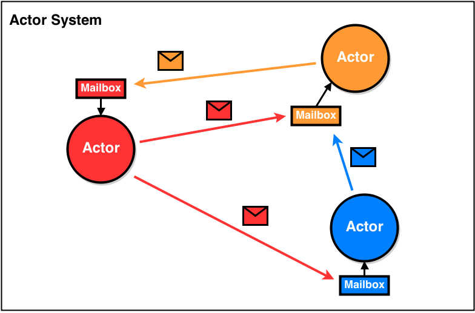
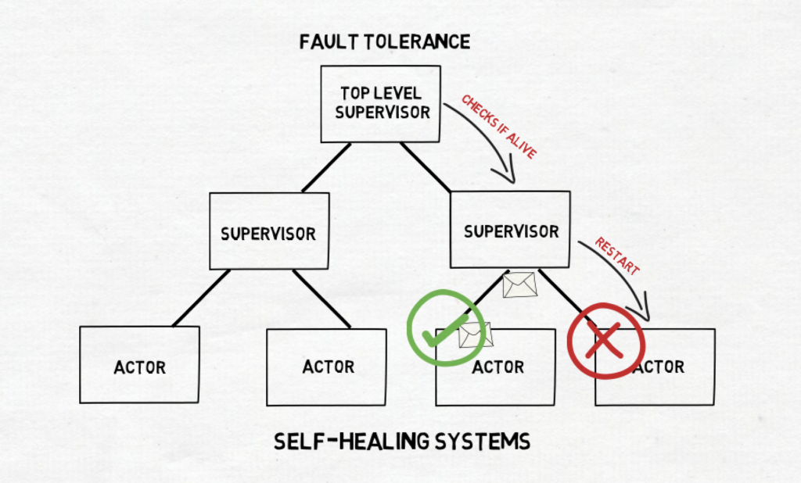

# Actors can rule your DDD world by [Hannes Lowette](https://twitter.com/hannes_lowette)
When developers learn about DDD, they tend to find a way to work the principles into their codebase. After a while, they may end up with some form of event sourcing or CQRS. 

But often times, the possibilities of using an `actor model`, such as `Akka.NET`, are overlooked.

In this talk I will show you to all the things you need to know if you want to build such a system using .NET 6 and Akka.NET. Expect to see a lot of code!

An elementary knowledge of DDD principles is required to attend this session.

## Sending beer is tricky
- What i want :
   - CQRS / ES
   - Clean agg
   - `Human readble tests`
- Akka.NET

- Guaranteed single thread
    - 1 thread per Actor

## Actors
- Actor hierarchy
   - Parent Actor
      -  Creating children
   - Supervision
      -  Action : Resume / Stop / Start / Escalate
      -  Strategy : OneforOne / OneforAll

## Aggregates and Actors

- Aggregate Actor
   - Wrap aggregate in Actor
   - AggregateActor
- How our actors will be structured ?
   - `Aggregate manager`
      -  Takes connect req
      -  Creates agg actirs if needed
      -  Uses Sender to send an IActorRef back
      -  1 aggregate actor per instance
   - `Command router`
      -  Takes in command
      -  Connects to agg
      -  Caches agg IActorRef
      -  Relays commands to Agg
      -  May become a botteleneck
   - `Projectors`
      -  Created at startup
      -  Subsribes to the Event Bus
      -  Ipdates the Read Storage (outside the ActorSystem)
      -  1 projector pet type 
   - Fold the event stream
      -  Created at startup
      -  Subsribes to the Event Bus
      -  Relays events to agg
      -  Events from other agg or outside systems
- Command Router
   - More actor than it can handle = problem
   - Pools / Groups
   - Routing strategy

## Persistence

- Akka.persistence
   - Event source by default
   - Inherits from `ReceivePersistentActor`
   - Snapshot comes for free

## Pub / Sub

- Internal Event Stream

## Clean Tests

## Resources
- AKKA .NET : https://getakka.net/
- Repo bootcamp : https://github.com/petabridge/akka-bootcamp
- Akka vs Orleans :https://github.com/akka/akka-meta/blob/master/ComparisonWithOrleans.md