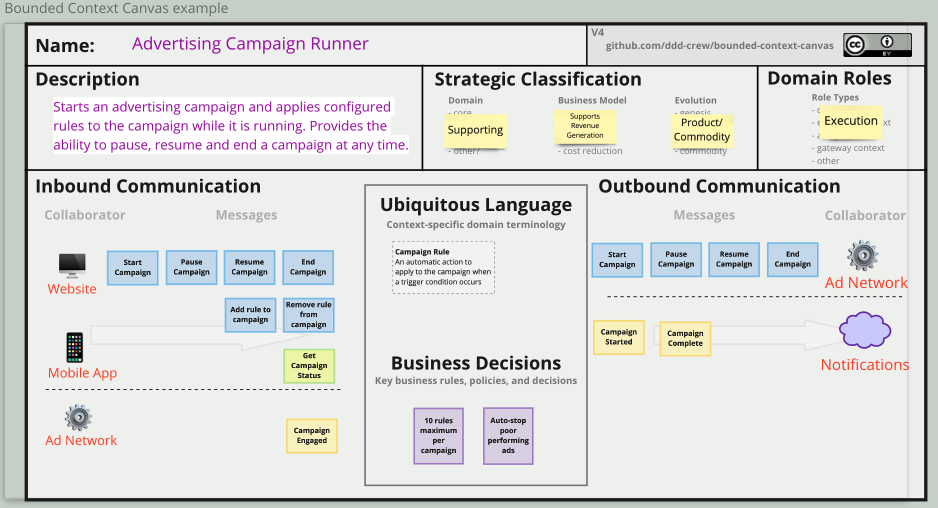
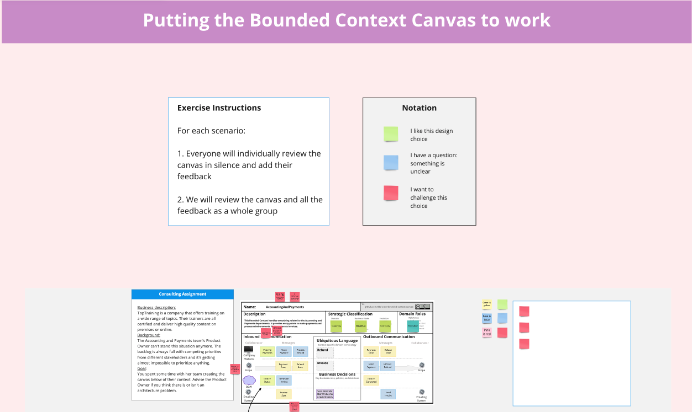
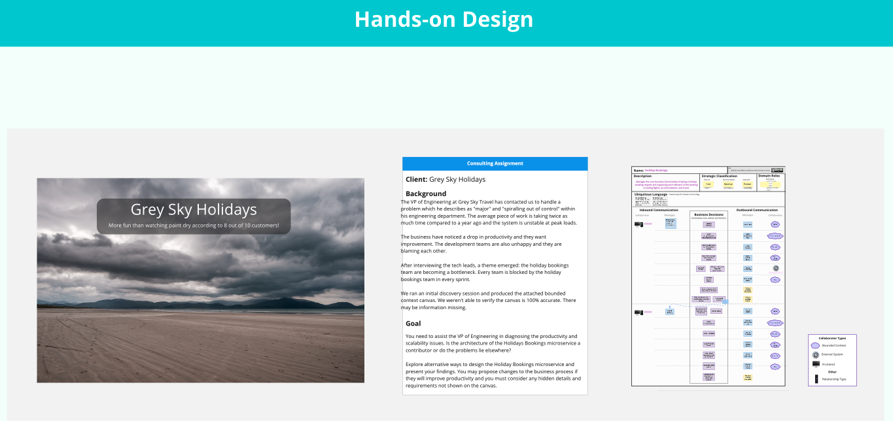
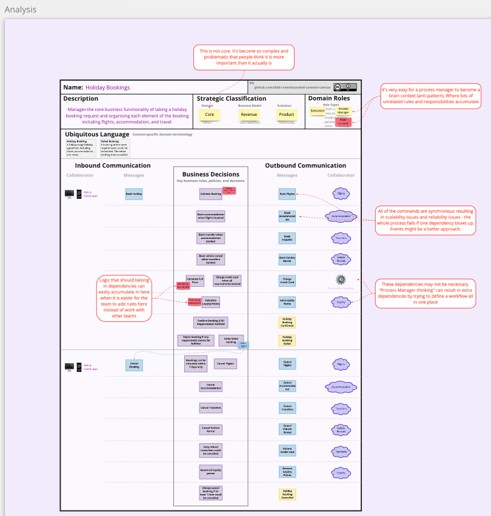

# Advanced Bounded Context Design With The Bounded Context Canvas by [Maxime Sanglan-Charlier](https://twitter.com/__MaxS__) and [Nick Tune](https://twitter.com/ntcoding)

## Bounded Context Canvas Example

## Practice

## Design

## Analysis

## Resources
- Miro board : https://miro.com/app/board/uXjVODGps0A=/
- DDD Starter Modelling process : https://github.com/ddd-crew/ddd-starter-modelling-process