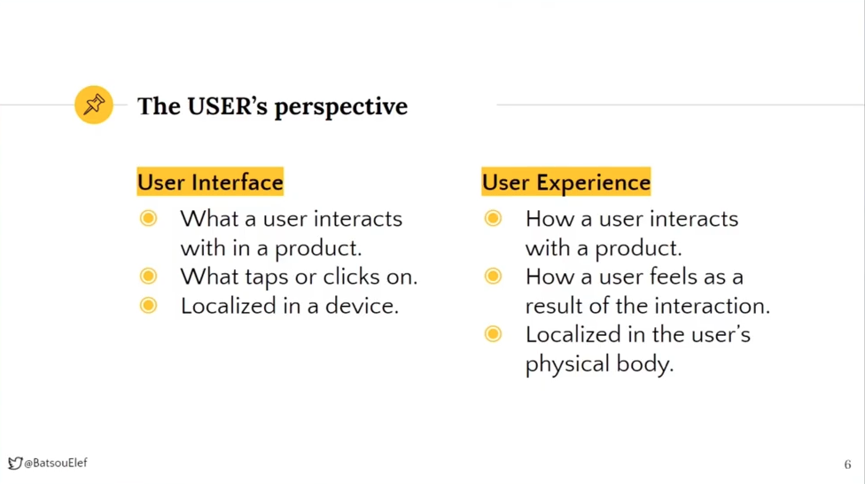
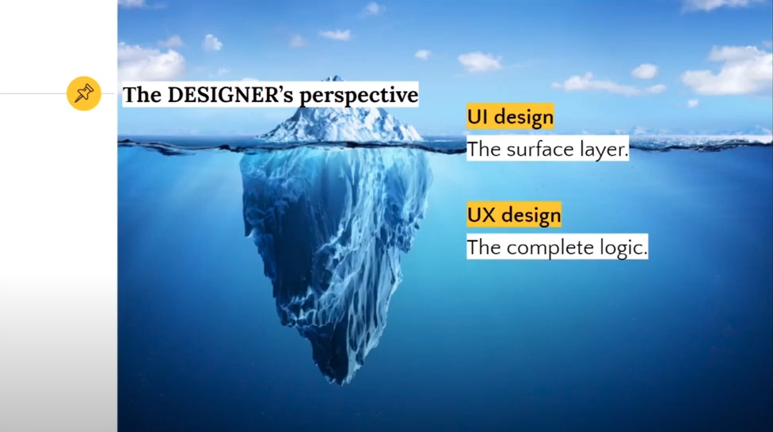
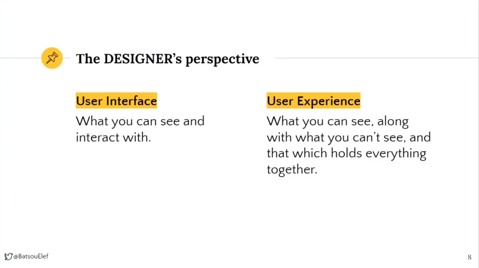
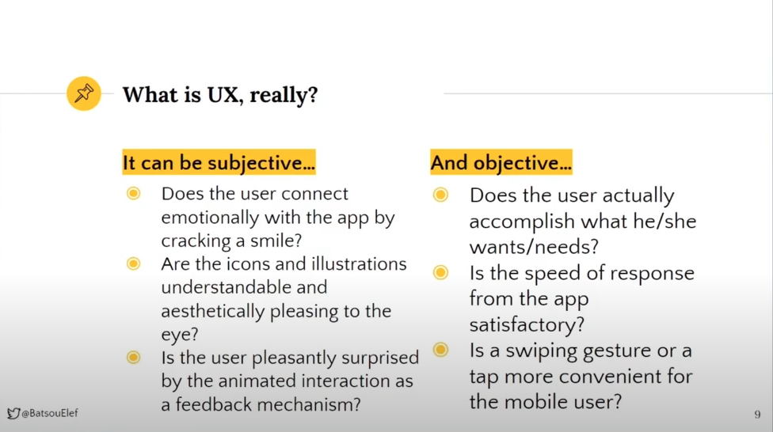
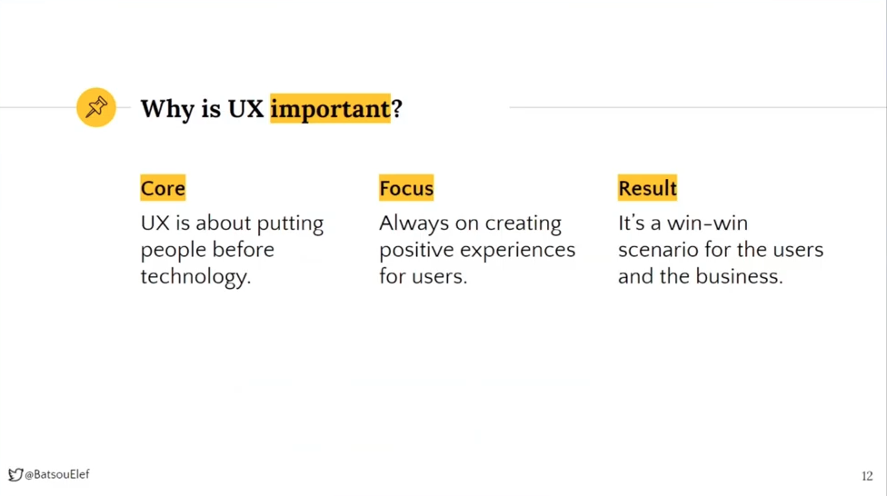
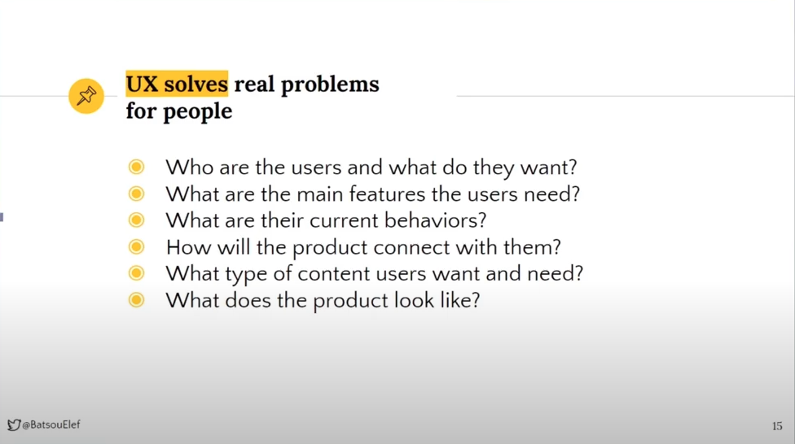
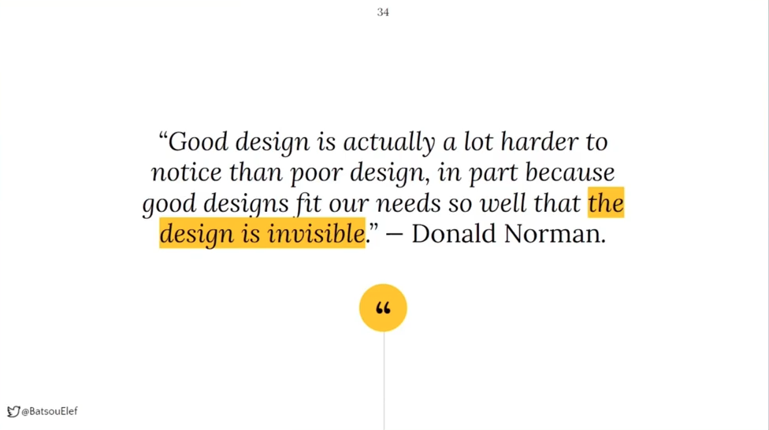
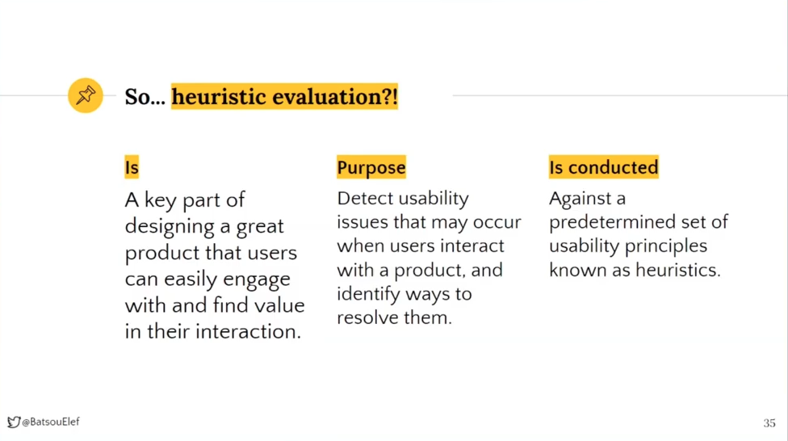
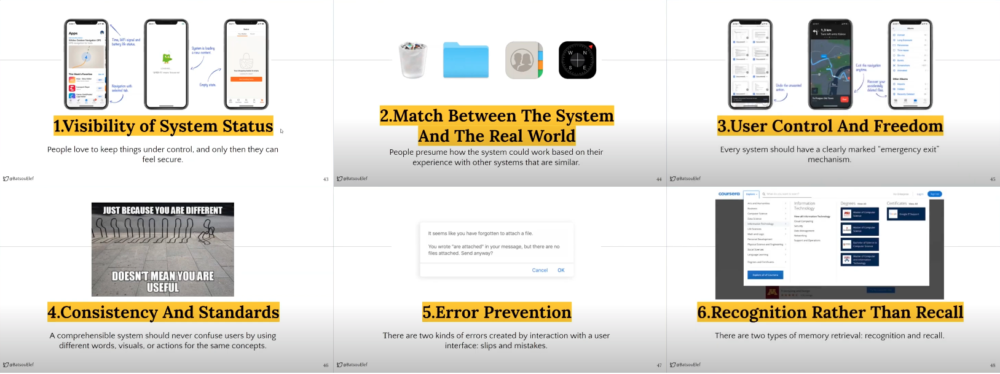
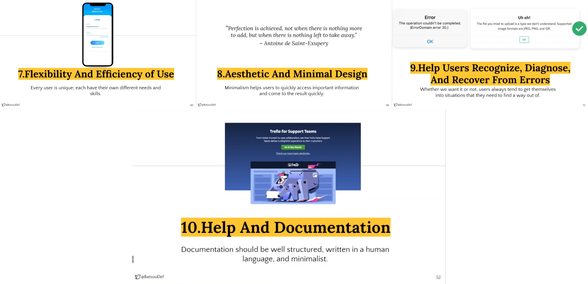

# It’s easy to create a good looking product, but what about a useful one? by [Eleftheria Batsou](https://twitter.com/BatsouElef)
It’s not enough to build apps that function, it's not even enough to make them understandable & usable, you need to build apps that bring joy & excitement, pleasure & fun, if possible even beauty to people’s lives.

## UX vs UI

## The 10 Usability Heuristics

## The Do's and Don'ts of UX
`The user at the center` :
- `Don't` assume you know what users want
- `Don't` follow the HIPPO in the room
    - Highest Paid Person`s Opinion
- `Do` make the time and effort for User Research
- `Do` understand all research options and the strengths of each
- `Don't` prototype too soon : even if you plan to test it
- `Do` focus on what people do, rather than what they say
- If you can only do one thing, `do` conduct User Testing
- `Don't` overlook existing insight from Customer Care representatives
- `Do` collaborate

## Resources
- Talk video : https://youtu.be/swMCmbEhFcc