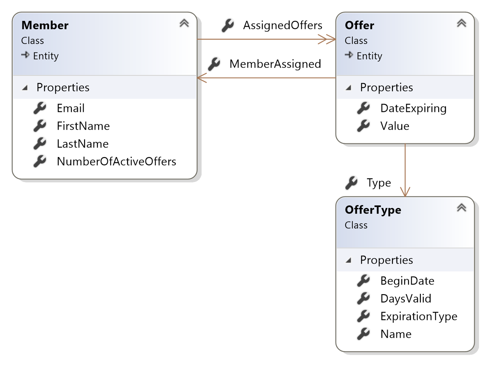
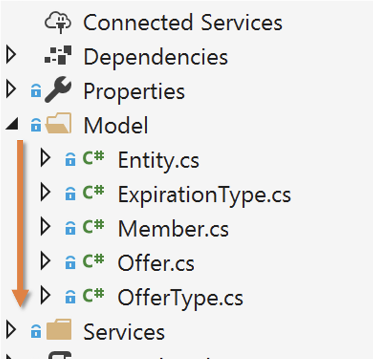

# Domain-Driven Refactoring by [Jimmy Bogard](https://jimmybogard.com/)
Books, workshops, storming and more, all build up an idealized domain model. All describe great techniques for domain-driven greenfield applications. But what about the code we have? How can we take what's already built, and move it towards a better, more cohesive design?

## State of the code


- Assess the code :
    - Names match stuff from real world
	- Where’s the behavior ?


- All the behaviors in the Service
- `Anemic Domain Model`...

```csharp
public class AssignOfferHandler : IRequestHandler<AssignOfferRequest>
{
    private readonly AppDbContext _appDbContext;
    private readonly HttpClient _httpClient;

    public AssignOfferHandler(
        AppDbContext appDbContext,
        HttpClient httpClient)
    {
        _appDbContext = appDbContext;
        _httpClient = httpClient;
    }

    public async Task<Unit> Handle(AssignOfferRequest request, CancellationToken cancellationToken)
    {
        var member = await _appDbContext.Members.FindAsync(request.MemberId, cancellationToken);
        var offerType = await _appDbContext.OfferTypes.FindAsync(request.OfferTypeId, cancellationToken);

        // Calculate offer value
        var response = await _httpClient.GetAsync(
            $"/calculate-offer-value?email={member.Email}&offerType={offerType.Name}",
            cancellationToken);

        response.EnsureSuccessStatusCode();

        await using var responseStream = await response.Content.ReadAsStreamAsync(cancellationToken);
        var value = await JsonSerializer.DeserializeAsync<int>(responseStream, cancellationToken: cancellationToken);

        // Calculate expiration date
        DateTime dateExpiring;

        switch (offerType.ExpirationType)
        {
            case ExpirationType.Assignment:
                dateExpiring = DateTime.Today.AddDays(offerType.DaysValid);
                break;
            case ExpirationType.Fixed:
                dateExpiring = offerType.BeginDate?.AddDays(offerType.DaysValid)
                                ?? throw new InvalidOperationException();
                break;
            default:
                throw new ArgumentOutOfRangeException();
        }

        // Assign offer
        var offer = new Offer
        {
            MemberAssigned = member,
            Type = offerType,
            Value = value,
            DateExpiring = dateExpiring
        };
        member.AssignedOffers.Add(offer);
        member.NumberOfActiveOffers++;

        await _appDbContext.Offers.AddAsync(offer, cancellationToken);

        await _appDbContext.SaveChangesAsync(cancellationToken);

        return Unit.Value;
    }
}
```

## Refactoring
- Look at usings
- Comments
- Code complexity
- Refactor to bettre encapsulation
- Ensure `Tell don't Ask` principle
- Made a lot of automatic refactorings

```csharp
public class AssignOfferHandler : IRequestHandler<AssignOfferRequest>
{
    private readonly AppDbContext _appDbContext;
    private readonly IOfferValueCalculator _offerValueCalculator;

    public AssignOfferHandler(
        AppDbContext appDbContext, IOfferValueCalculator offerValueCalculator)
    {
        _appDbContext = appDbContext;
        _offerValueCalculator = offerValueCalculator;
    }

    public async Task<Unit> Handle(AssignOfferRequest request, CancellationToken cancellationToken)
    {
        var member = await _appDbContext.Members.FindAsync(request.MemberId, cancellationToken);

        var offerType = await _appDbContext.OfferTypes.FindAsync(request.OfferTypeId, cancellationToken);

        var offer = await member.AssignOffer(offerType, _offerValueCalculator);

        await _appDbContext.Offers.AddAsync(offer, cancellationToken);

        await _appDbContext.SaveChangesAsync(cancellationToken);

        return Unit.Value;
    }
}

public class Offer : Entity
{
    public Member MemberAssigned { get; private set; }
    public OfferType Type { get; private set; }
    public DateTime DateExpiring { get; private set; }
    public int Value { get; private set; }

    public Offer(Member memberAssigned, OfferType type, int value)
    {
        MemberAssigned = memberAssigned;
        Type = type;
        DateExpiring = type.CalculateExpirationDate();
        Value = value;
    }
}

```
		


## Resources
- Source code : https://github.com/jbogard/presentations/tree/master/DomainDrivenRefactoring
- Refactoring to Patterns book : https://martinfowler.com/books/r2p.html
- Part of Refactoring to Patterns book [here](https://github.com/abhinavkorpal/awesome-computer-science-EBook/blob/master/DesignPatterns/Refactoring%20To%20Patterns%20-%20Joshua%20Kerievsky.pdf)
- Refactoring to patterns in C# : 
https://github.com/corywheeler/refactoringtopatterns