# Event Sourcing - what could possibly go wrong? by [Andrzej Ludwikowski](https://twitter.com/aludwikowski)
Yet another presentation about Event Sourcing? Yes and no. Event Sourcing is a really great concept. Some could say it’s a Holy Grail of the software architecture.

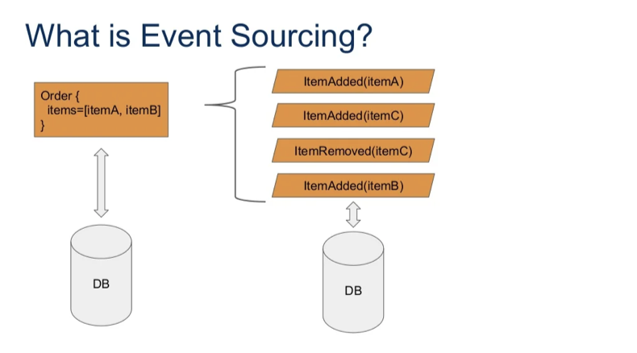
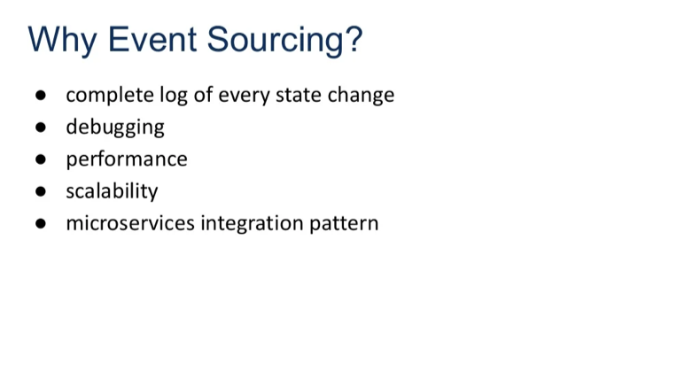
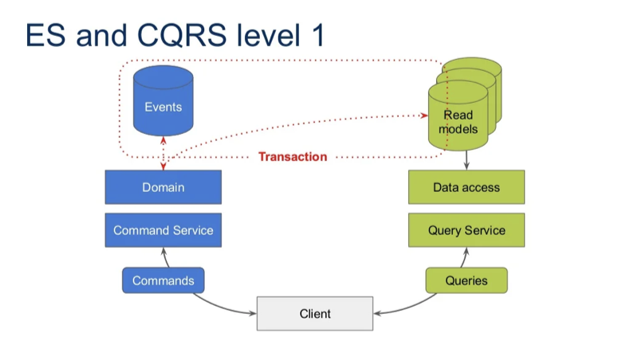
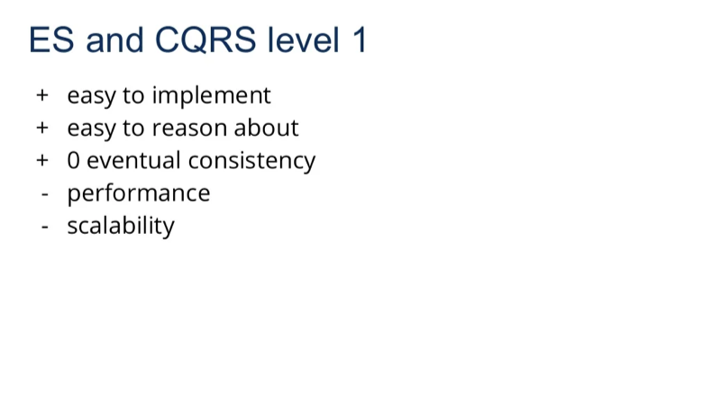
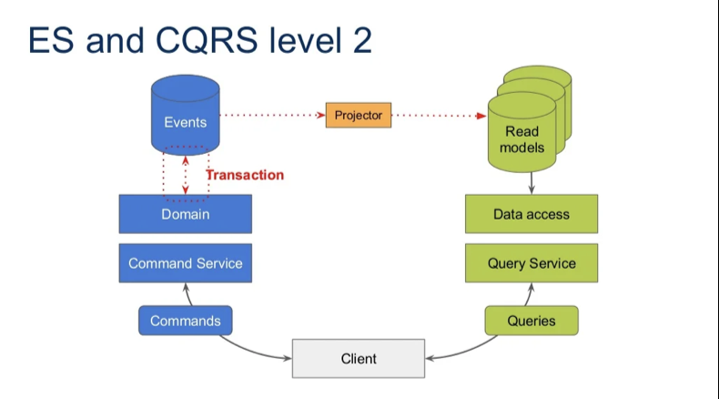
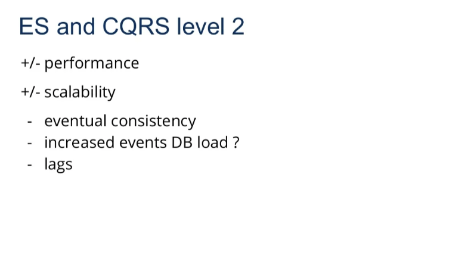
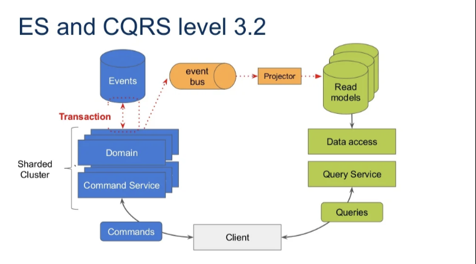
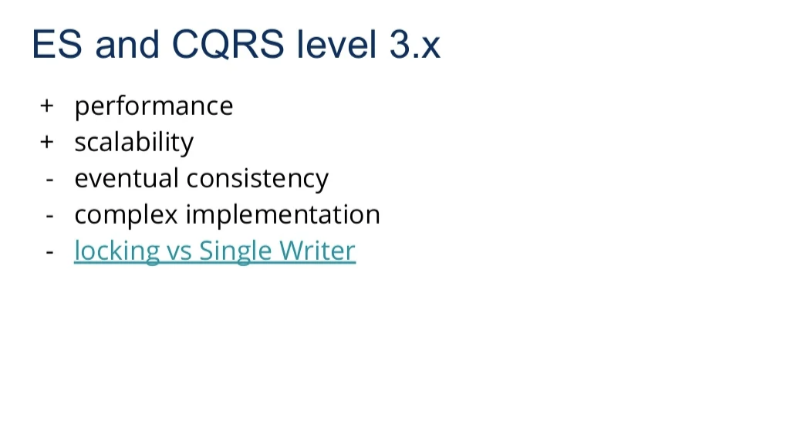
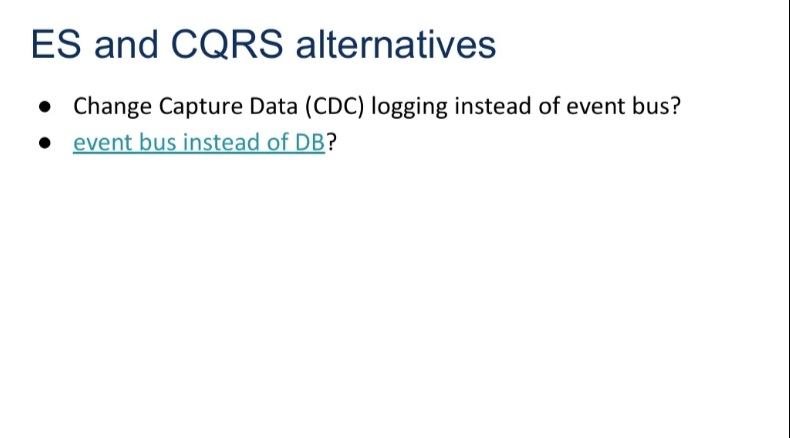
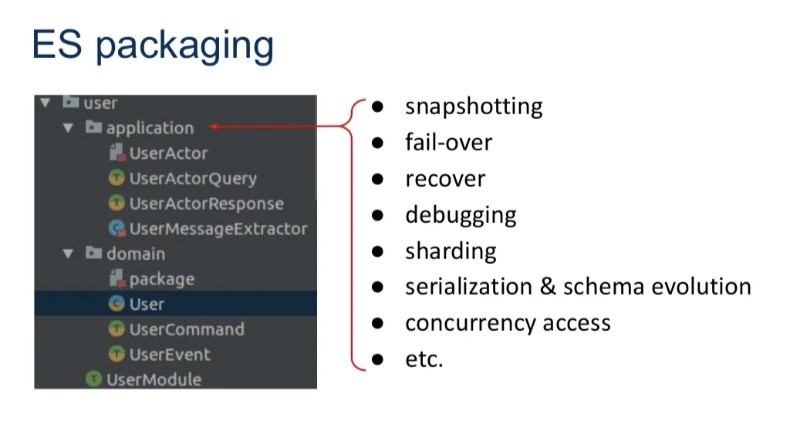
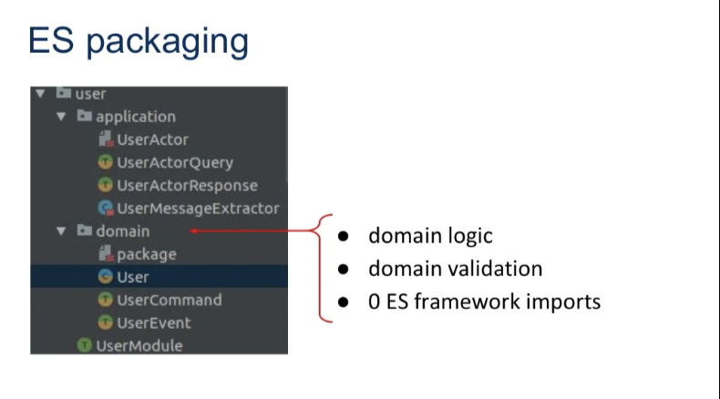
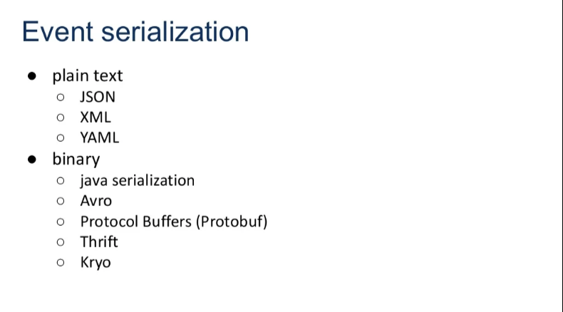
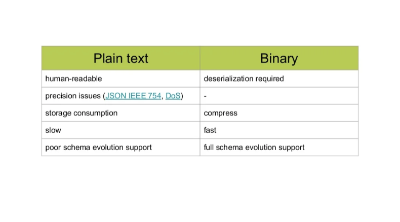

- Carefully choose ES lib/framework
    - Take your time to POC and make your choice
- Think about serialization / deserialization
- There is no perfect database for event sourcing
- Understand event/command/state schema evolution
- Eventual consistency is your friend
    - Understand deeply what is it
    - How it can help you achieve your objectives

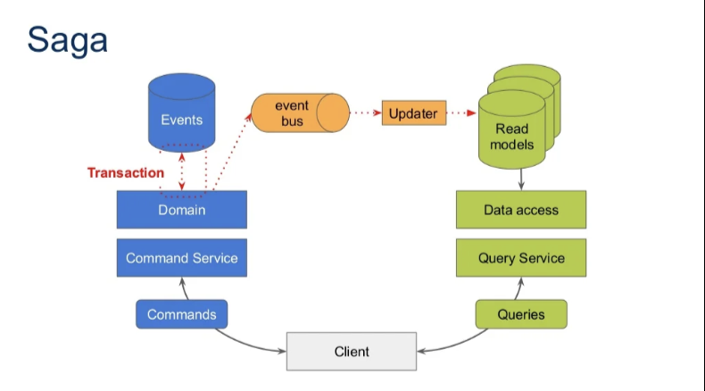
- Orchestration vs Choreography

## Resources
- Slides : https://www.slideshare.net/AndrzejLudwikowski/event-sourcing-what-could-possibly-go-wrong-devoxx-pl-2021