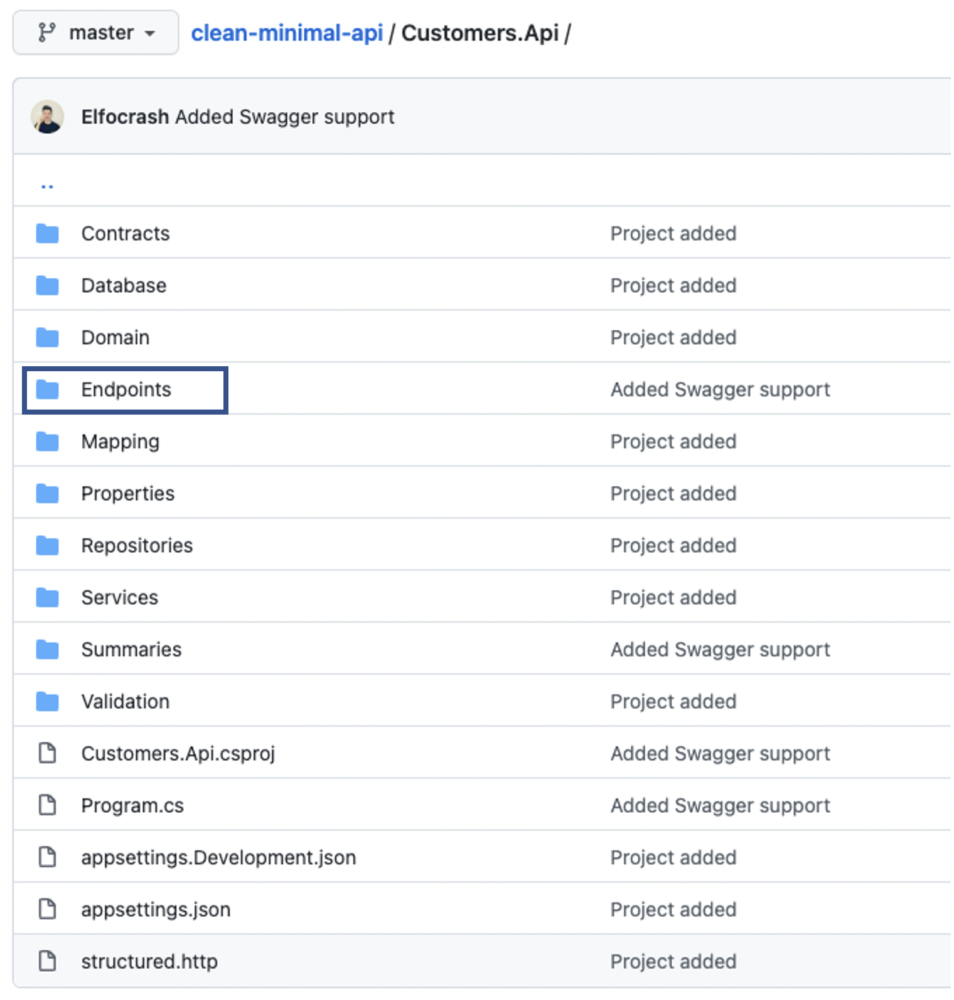

# Goodbye controllers, hello Minimal APIs by [Nick Chapsas](https://twitter.com/nickchapsas)
Minimal APIs are the hottest .NET 6 feature and for good reason. They makes it extremely easy to create high performance and scalable APIs without having to deal with any boilerplate code.

- Write APIs with much less boilerplates
    - Like with [express](https://expressjs.com/)

- What has been done to make it possible ?
    - Implicit using statements (enable it in csproj)
    - Global usings

```xml
<PropertyGroup>
    <OutputType>Exe</OutputType>
    <TargetFramework>net6.0</TargetFramework>
    <ImplicitUsings>enable</ImplicitUsings>
    <Nullable>enable</Nullable>
</PropertyGroup>
```
- How does it look like in your `Program.cs` ?

```csharp
using Customers.Api.Contracts.Responses;
using Customers.Api.Database;
using Customers.Api.Repositories;
using Customers.Api.Services;
using Customers.Api.Validation;
using FastEndpoints;
using FastEndpoints.Swagger;

var builder = WebApplication.CreateBuilder(args);
var config = builder.Configuration;

builder.Services.AddFastEndpoints();
builder.Services.AddSwaggerDoc();

builder.Services.AddSingleton<IDbConnectionFactory>(_ =>
    new SqliteConnectionFactory(config.GetValue<string>("Database:ConnectionString")));
builder.Services.AddSingleton<DatabaseInitializer>();
builder.Services.AddSingleton<ICustomerRepository, CustomerRepository>();
builder.Services.AddSingleton<ICustomerService, CustomerService>();

var app = builder.Build();

app.UseMiddleware<ValidationExceptionMiddleware>();
app.UseFastEndpoints(x =>
{
    x.ErrorResponseBuilder = (failures, _) =>
    {
        return new ValidationFailureResponse
        {
            Errors = failures.Select(y => y.ErrorMessage).ToList()
        };
    };
});

app.UseOpenApi();
app.UseSwaggerUi3(s => s.ConfigureDefaults());

var databaseInitializer = app.Services.GetRequiredService<DatabaseInitializer>();
await databaseInitializer.InitializeAsync();

app.Run();
```

- Code organization



- Example of `Endpoint`
    - It enable to better split our code
    - Have a better constructor injection logic
        - Pass only what is needed for the given Endpoint

```csharp
namespace Customers.Api.Endpoints;

[HttpPost("customers"), AllowAnonymous]
public class CreateCustomerEndpoint : Endpoint<CreateCustomerRequest, CustomerResponse>
{
    private readonly ICustomerService _customerService;

    public CreateCustomerEndpoint(ICustomerService customerService)
    {
        _customerService = customerService;
    }

    public override async Task HandleAsync(CreateCustomerRequest req, CancellationToken ct)
    {
        var customer = req.ToCustomer();

        await _customerService.CreateAsync(customer);

        var customerResponse = customer.ToCustomerResponse();
        await SendCreatedAtAsync<GetCustomerEndpoint>(
            new { Id = customer.Id.Value }, customerResponse, generateAbsoluteUrl: true, cancellation: ct);
    }
}
```

- Not supported `for now`
   - Filters : Input validation for example
   - Odata
   - ApiVersioning
- Are not
   - One file apis
   - Just for demos
   - Just for beginners
   - Going to kill controllers

## Filters available in the future .NET 7


## Resources
- Source code : https://github.com/Elfocrash/clean-minimal-api
- Minimal APIs just got all I wanted in .NET 7 video : https://youtu.be/Kt9TiXrwIp4
- Microsoft documentation : https://docs.microsoft.com/en-us/aspnet/core/tutorials/min-web-api?view=aspnetcore-6.0