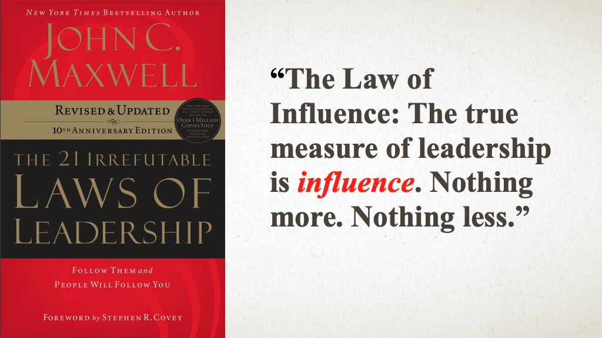

# Leadership lessons from the Agile Manifesto by [Anjuan Simmons](https://twitter.com/anjuan)
Whether you’re a Tech Lead, Engineering Manager, or Project Manager for an engineering team, you probably were not handed an instruction manual when you were given your first team to lead. 
This talk will show you `how to apply the principles in the Agile Manifesto to become a better leader`.


- `True measurement of leadership is influence`
- Aim for Transformation (`influence`) over Transaction (`reward/punishment`)

## Individuals and interactions over processes and tools : Team Influence
- Have strong influence
- If you have the right people, it will work no matter processes and tools
    - The opposite is false


`Preserve dignity at all costs`

### Hiring process
- Take it very seriously 
    - On-board 1 person
        - You have a new team
- Process must be done with dignity
- Hiring process : 
    - Value added interviews
        - Not by managing engineer
        - Which could the person bring ?
        - Questions are open, available online
    - Open questions : 
        - Detect if the person mentions teams (follow up this question)
        - Why this person coming in my team

#### Example of question
```markdown
- Tell me about a technical project you worked on that you are particularly proud of
    - How did the product or system change from the time you started to when you left?
    - How did you influence those changes?
    - Who did you work with on the team?
```

### Firing
- Person unable to perform
- Should not be a surprise
- `It’s my fault`
    - You are admitting a failure
- Firing as human by Kevin Godsmith
- Involves HR business partner to preserve person dignity
    - Try everything to help when the person struggles
    - Establish plan and target in advance
    - Provide support and help to achieve goals
- You were not a fit for us but you have plenty of strengths :…

## Working software over comprehensive documentation : Build Influence


`Working always ships faster than perfect`

## Customer collaboration over contract negotiation : Customer influence


- `Customers trust colleagues, not contracts`
- Work side by side with your customers

## Responding to change over following a plan : Schedule influence


- When doing plans : you don’t manage people but plans…
- Hard to predict
- `Don’t fear surprises, fear inflexibility`
- Eliminate inflexibility

## Resources
- Slides :https://speakerdeck.com/anjuan/leadership-lessons-from-the-agile-manifesto 
- Hiring questions at `Helpscout` : https://github.com/helpscout/interview-questions
- Firing like a human by Kevin Goldsmith : https://leaddev.com/sites/default/files/2022-03/%5BKevin%20Goldsmith%5D%20Firing%20Like%20a%20Human.pdf
- Lead Dev Website : https://leaddev.com/
- Book - [the hero with a thousand face](https://en.m.wikipedia.org/wiki/The_Hero_with_a_Thousand_Faces)
- Book : 21 irrefutable laws of leadership - John C Maxwell