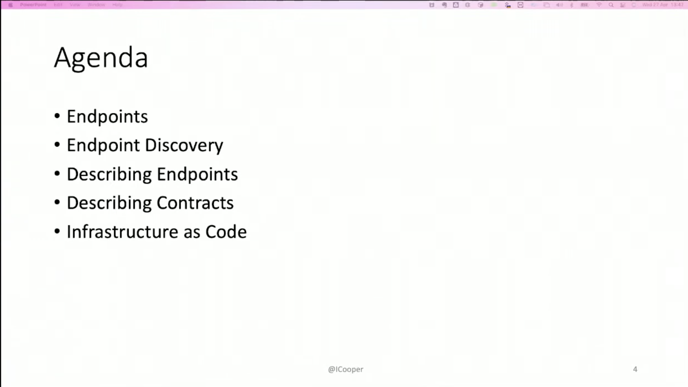
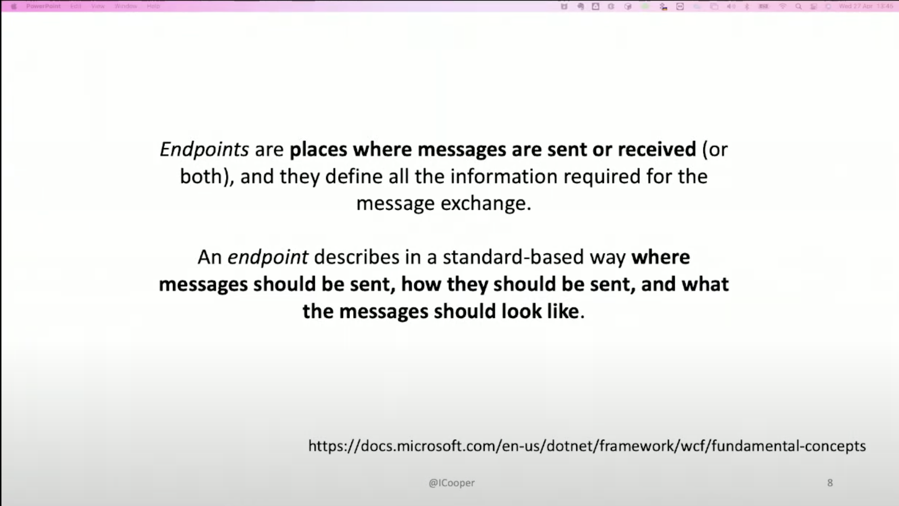
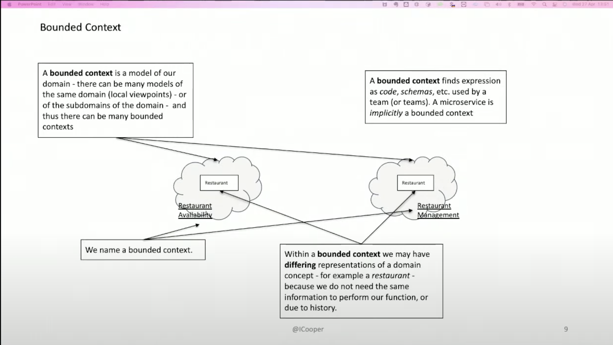
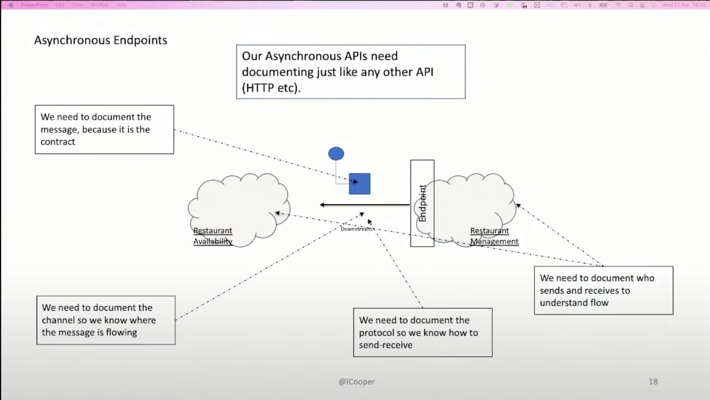
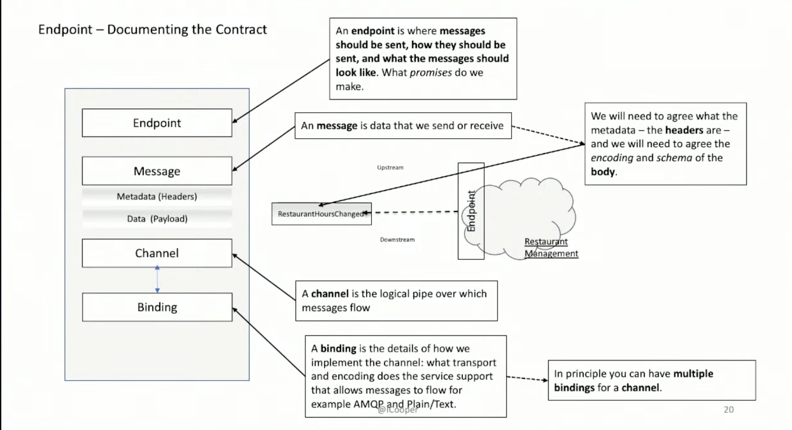
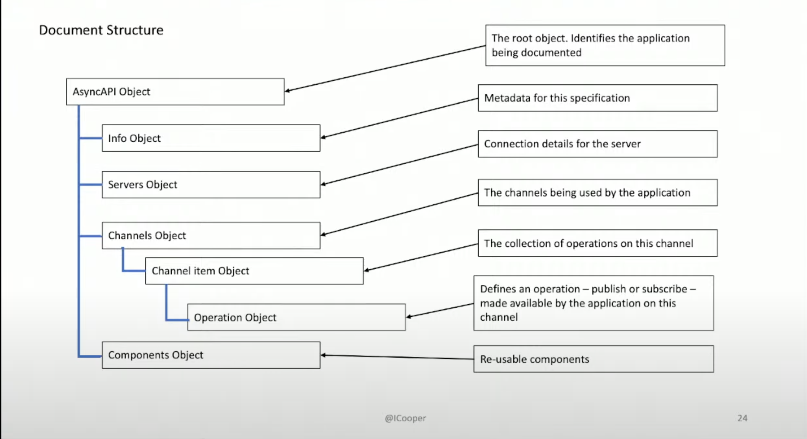
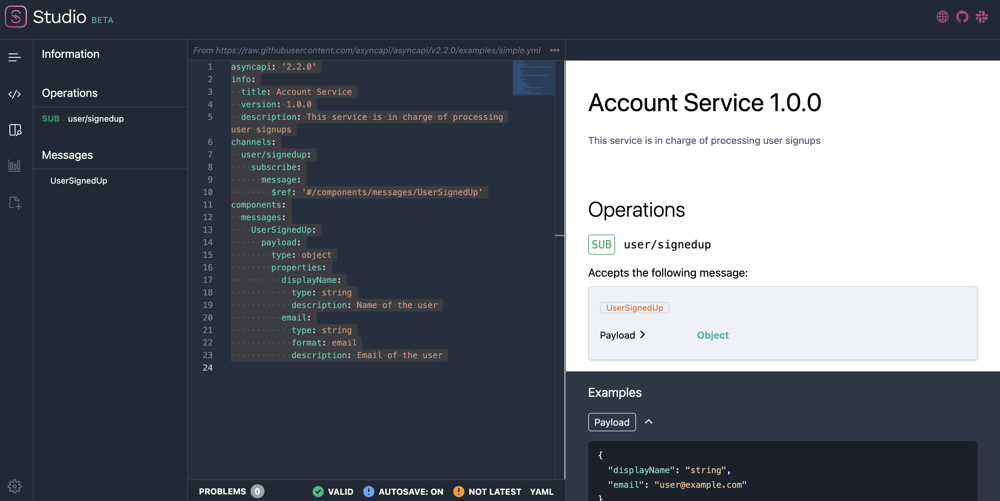
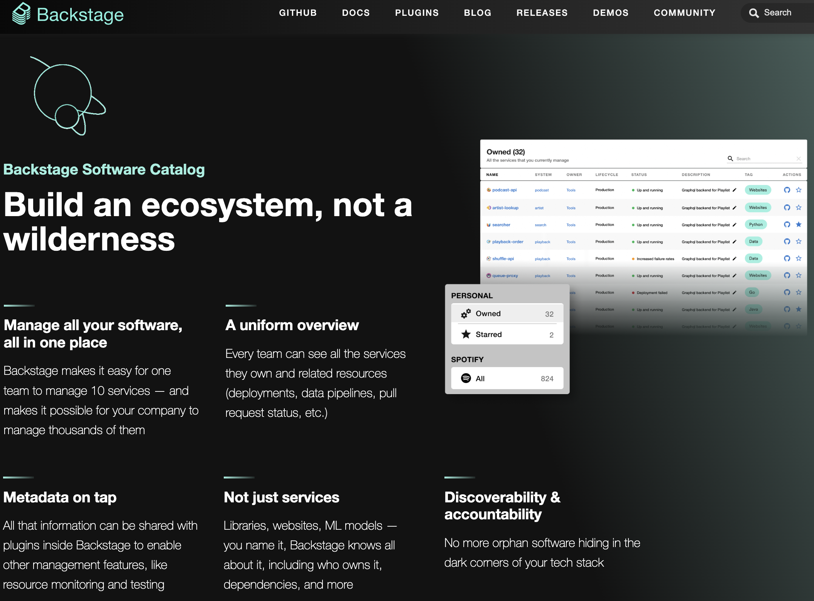
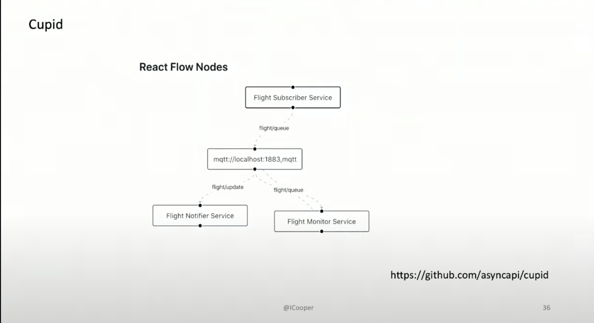
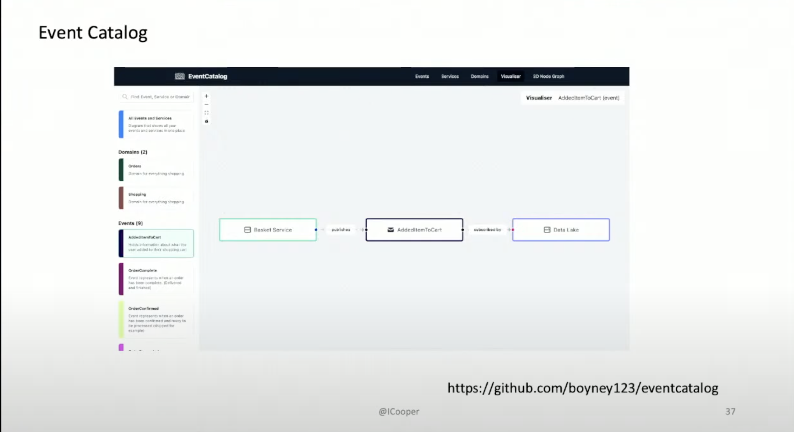

# Managing Event Driven Architectures by [Ian Cooper](https://twitter.com/ICooper)
You should be careful what you wish for. Once you have succeeded in persuading your team to adopt an event-driven architecture for communication between your microservices, you hit the problem of how to manage that event-driven architecture.









- Example :
```yaml 
asyncapi: '2.2.0'
info:
  title: Account Service
  version: 1.0.0
  description: This service is in charge of processing user signups
channels:
  user/signedup:
    subscribe:
      message:
        $ref: '#/components/messages/UserSignedUp'
components:
  messages:
    UserSignedUp:
      payload:
        type: object
        properties:
          displayName:
            type: string
            description: Name of the user
          email:
            type: string
            format: email
            description: Email of the user
```



## Developer catalog @spotify







## Resources
- Brighter : https://www.goparamore.io/
- AsyncApi : https://www.asyncapi.com/
- Backstage : https://backstage.io/
- CloudEvents : https://cloudevents.io/
- EventCatalog : https://github.com/boyney123/eventcatalog