# Building Teams Through Systems Thinking and Stories by [Scott Hanselman](https://www.hanselman.com/)

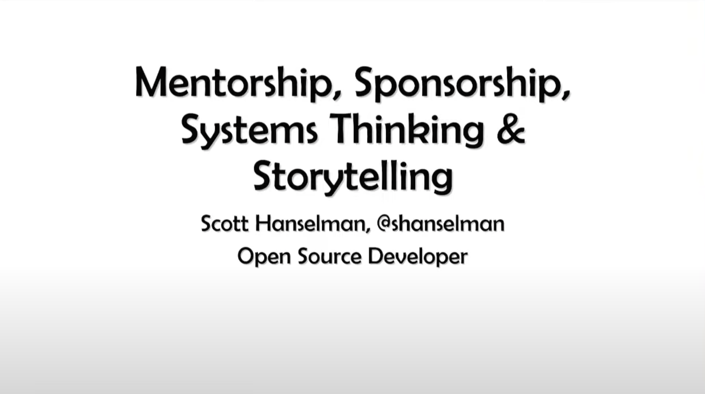
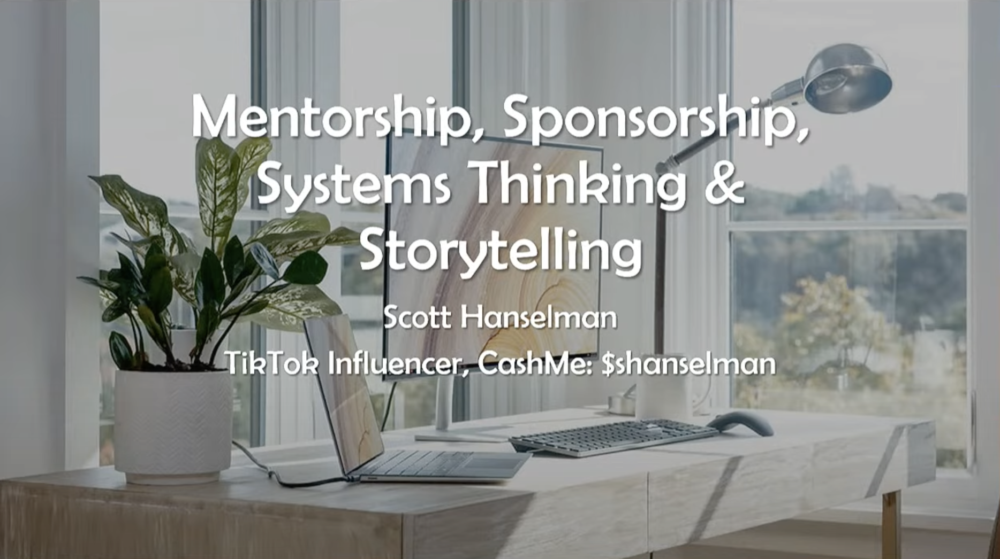
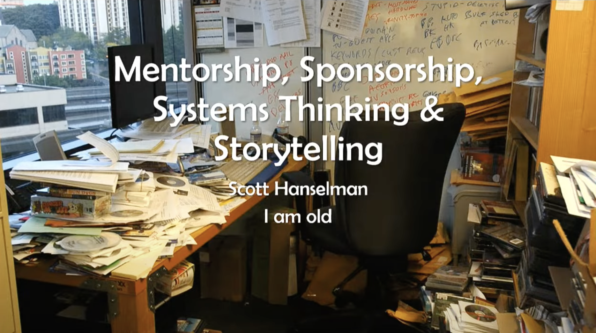
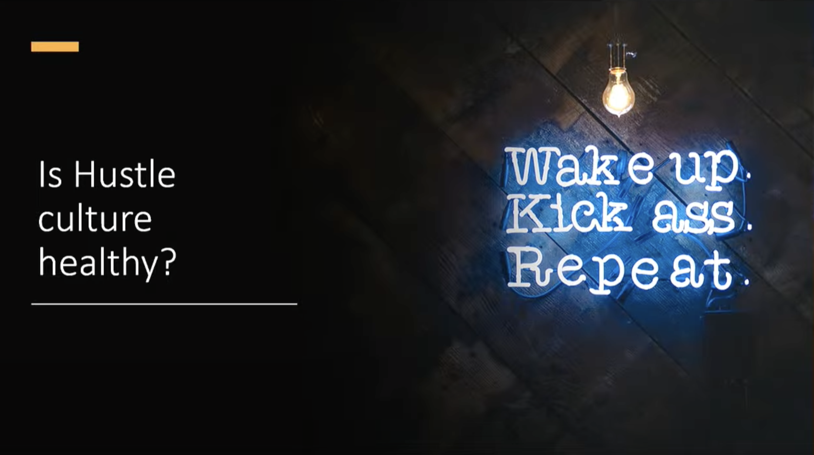
- Hustle Culture is not healthy
    - Enforced with Covid
    - Create your Nest
    - Find the balance

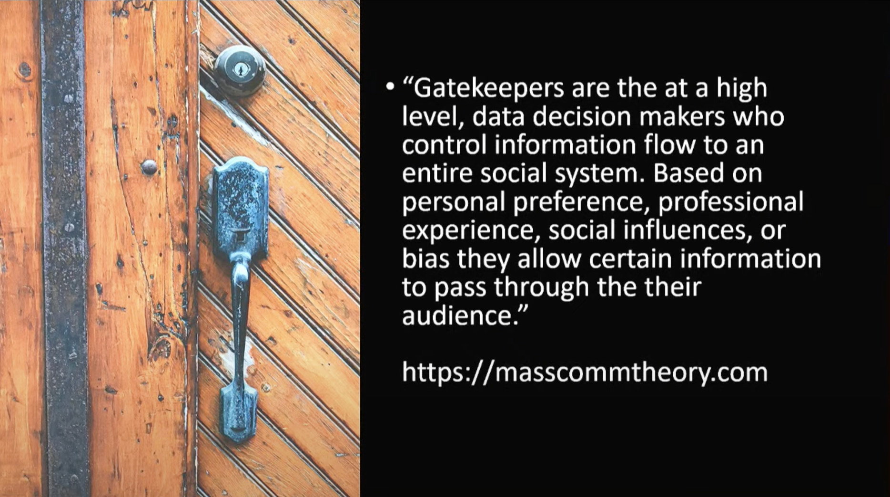

- We can do differently
- The manager who says "Sorry but I m not the one who decides"
    - Yes you are...
    - We can all change the system

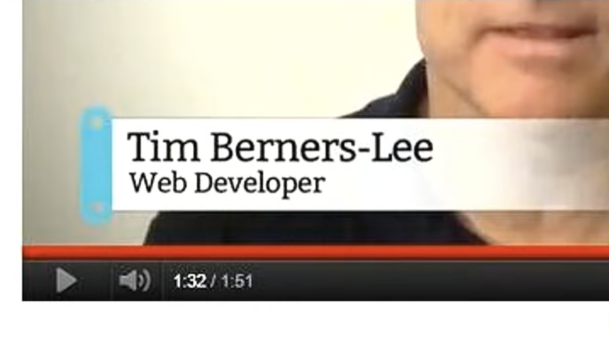
- Title like Senior Software Engineer vs "Web Developer" for the creator of the Web
- `Be humble`

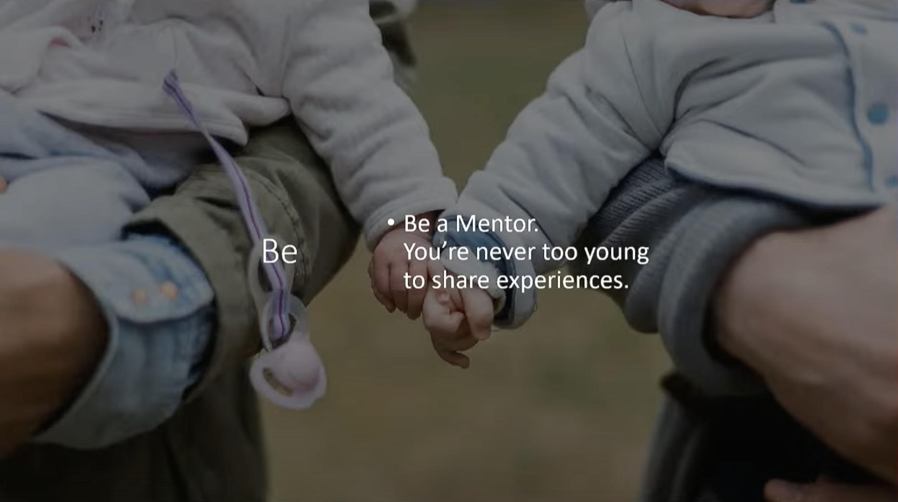
- Take a younger mentor
    - Can provide you new range of ideas

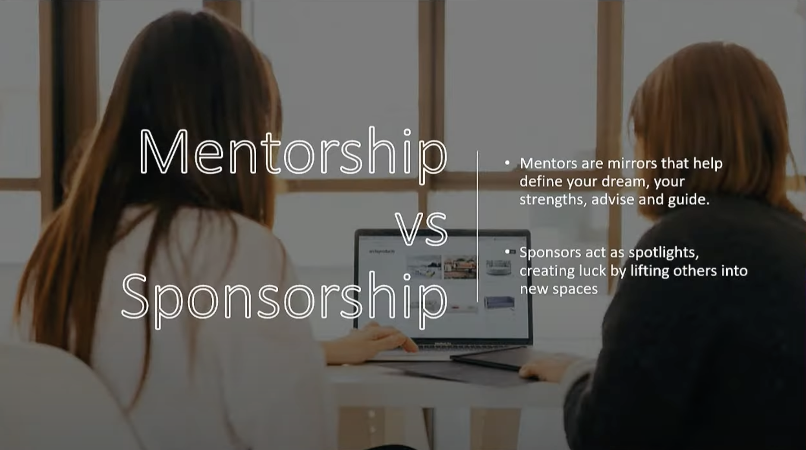
- Try to Spotlights others
    - Without saying it
    - Create them opportunities

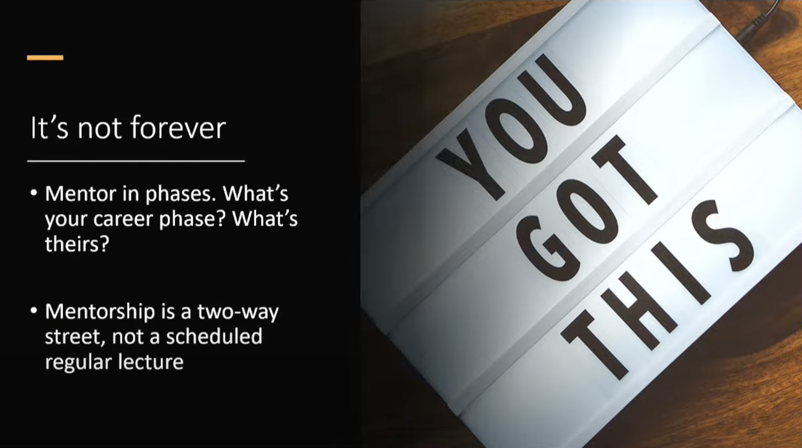

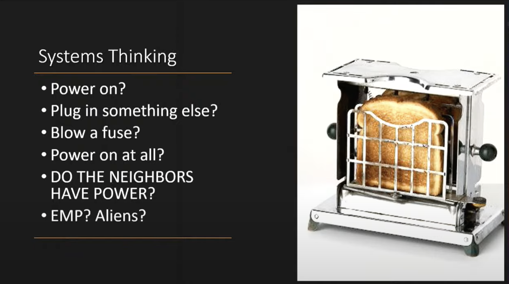
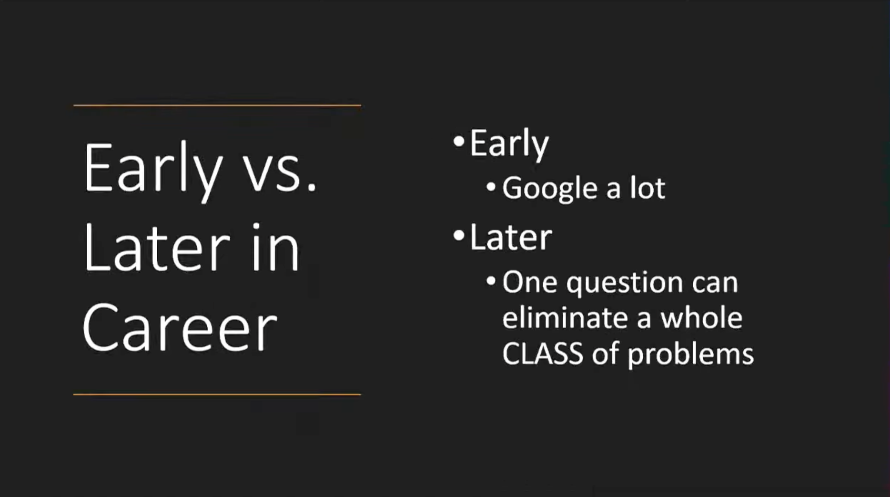
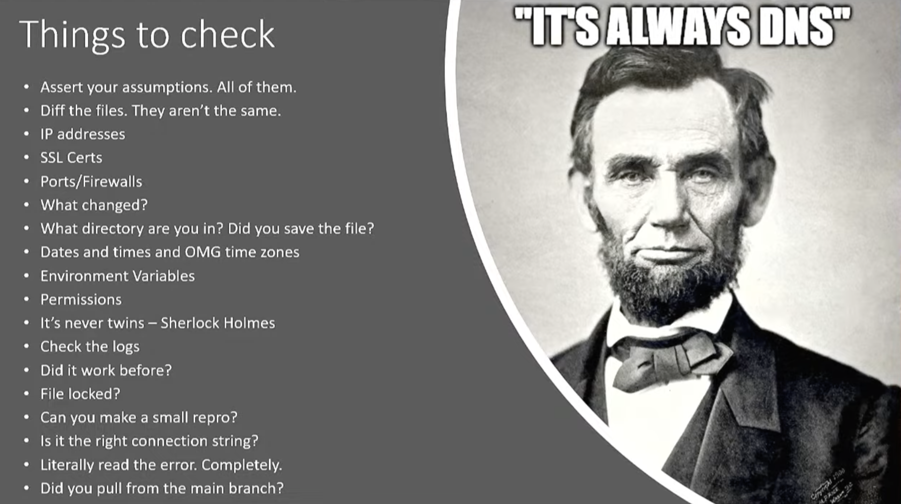
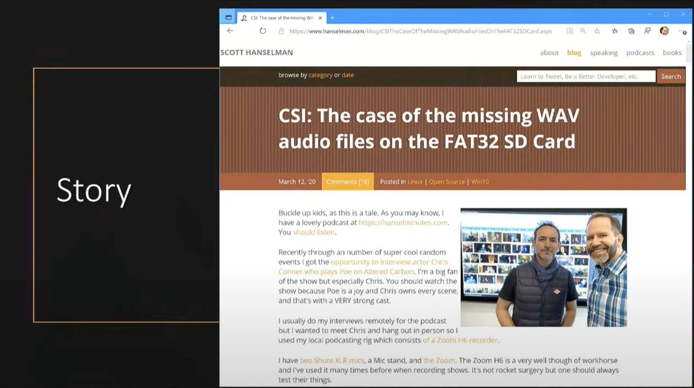
- All ideas are from other ideas
- `You miss every shot you dont take`

## Resources 
- Talk available [here](https://youtu.be/VFIw0LlULyc)
- Mass Comm Theory :https://masscommtheory.com/
- Keys Left : https://keysleft.com/