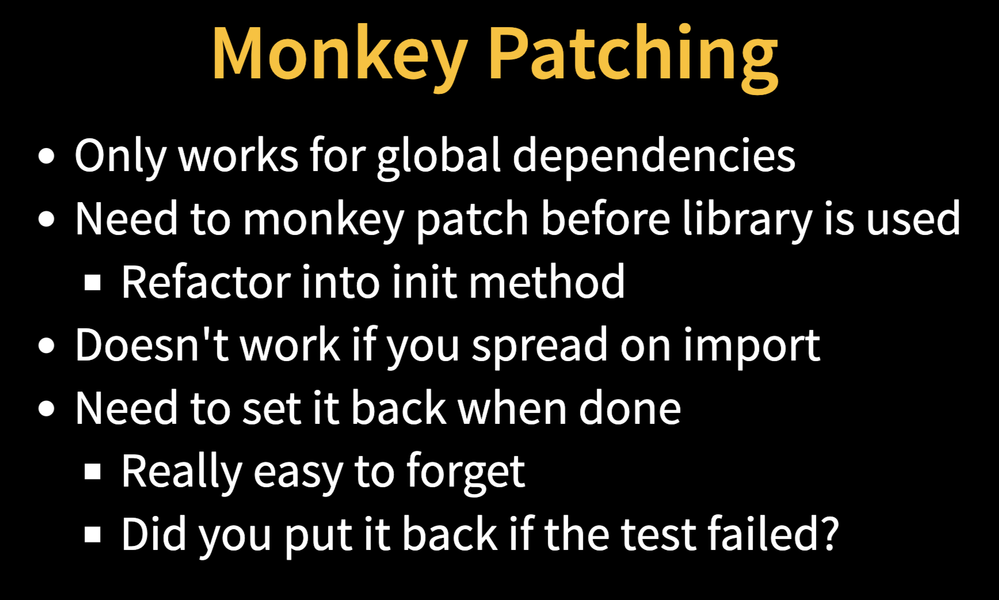
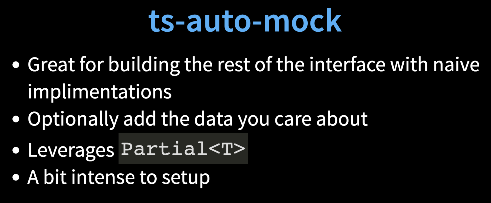
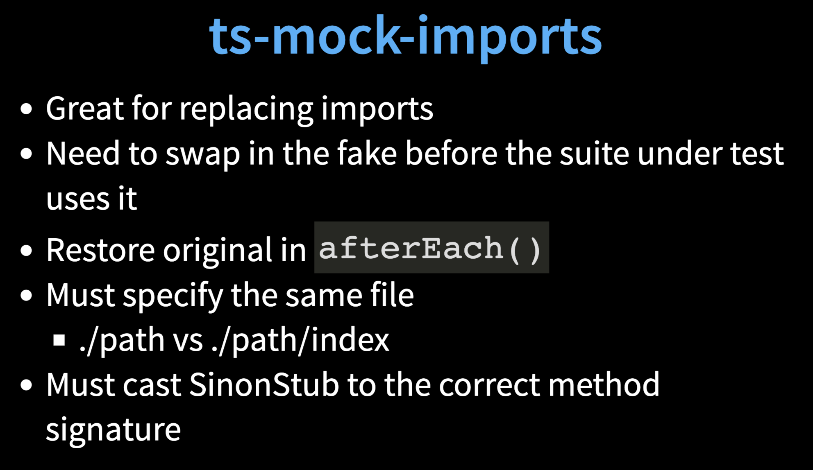

# Mocking in Front-end and Back-end TypeScript Tests by [Rob Richardson](https://robrich.org)
In this code-focused tour, we’ll systematically analyze the test scenarios we want to build, then live-code mocks in two scenarios: `Express` and `Vue`. It’s easy to gain value and speed once you know how.

## The Problem
- How do I test this thing that depends on that thing without also testing that thing?

```typescript
import { dataAccess } from './data-access';

export default function calculate(date: Date): number {
  const data = dataAccess(date);
  const result = data
      .map(d => d.amount)
      .reduce((pv, cv) => pv + cv, 0);
  return result;
}
````
- In TypeScript most things are singletons
    - Singletons have hard-coded dependencies
- Interfaces only exist at design time
    - Can't reflect interface and build a type at runtime
- Typescript requires the full interface implementation
    - The test only cares about a few things

## Solutions
### Everything is any


### Monkey Patching
```typescript
import _ from 'lodash';
const origRandom = _.random;
_.random = function (...) { ... } // <-- yes!
import mylib from './mylib';
// ...
_.random - origRandom;
```


### [ts-auto-mock](https://www.npmjs.com/package/ts-auto-mock)
`Mock the rest of the interface`
```typescript
import { createMock } from 'ts-auto-mock';
import { Request } from 'express';

// ...

const req: Request = createMock<Request>({
  body: {
    obj: vals
  }
});
```


### [ts-mock-imports](https://npmjs.org/ts-mock-imports)
- Mock imports
- Built on top of Sinon

```typescript
import { ImportMock } from 'ts-mock-imports';
import { SinonStub } from 'sinon';
import * as dep from '../dependency';
import { myfunc } from '../suiteUnderTest';

describe('mytest', () => {
  let mock: SinonStub<[In, Args], ReturnType>;

  afterEach(() => {
    if (mock) {
      mock.restore();
    }
  });

  it('should work', () => {
    const returnval = 100;
    scoreMock = ImportMock.mockFunction(dep, 'methodname', returnval) as SinonStub<[In, Args], ReturnType>;
    myfunc();
    // ...
  });
});
```


## Resources
- Slides : https://robrich.org/slides/mocking-typescript/
- Source code : 
https://github.com/robrich/mocking-typescript#readme