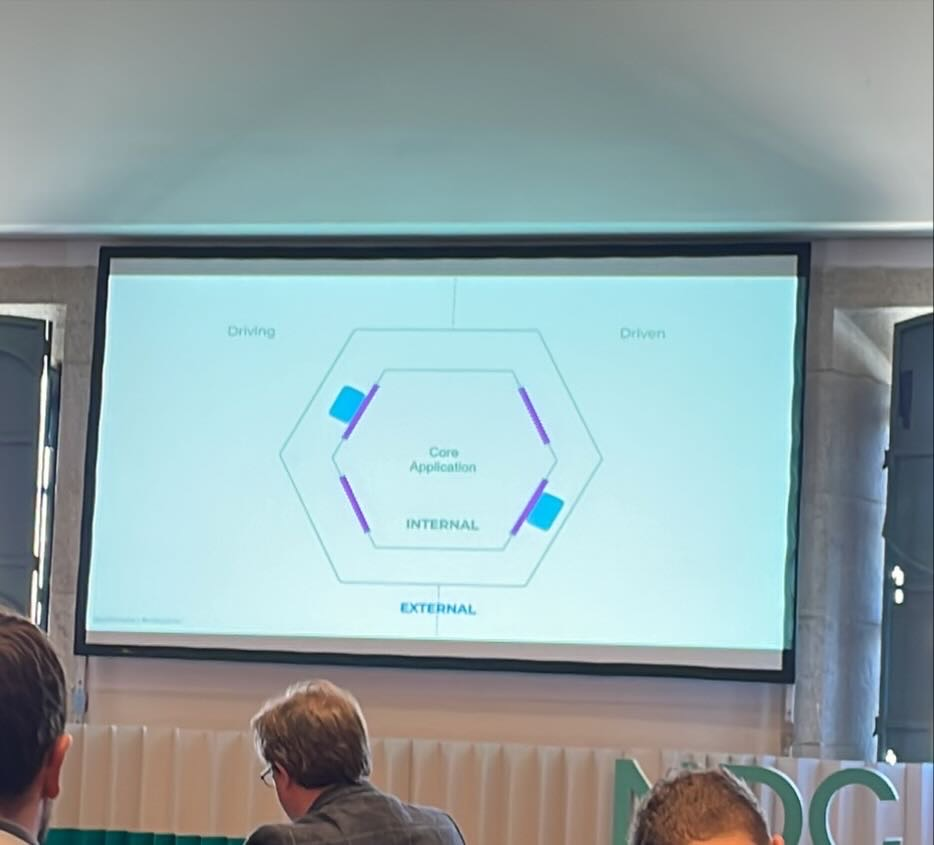
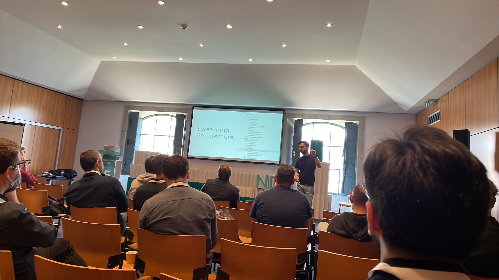
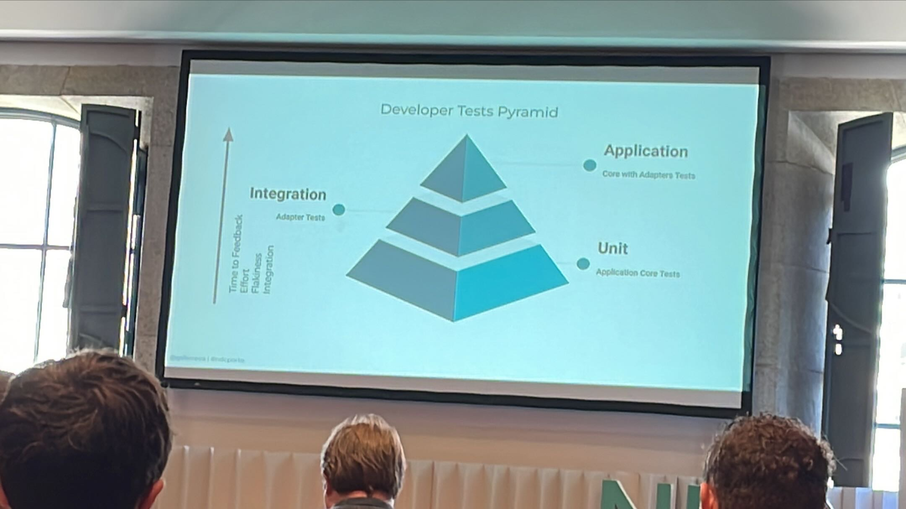
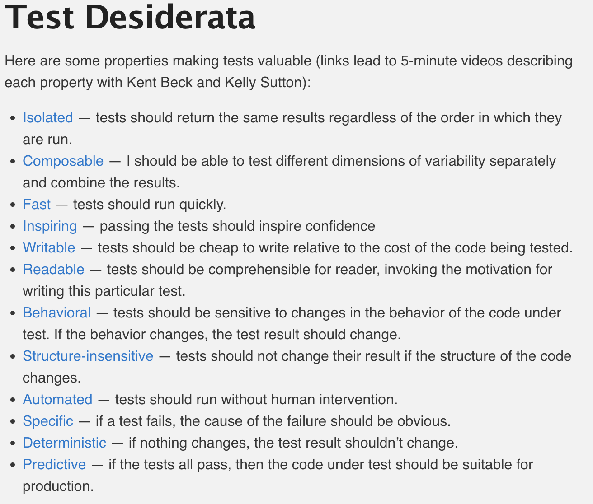
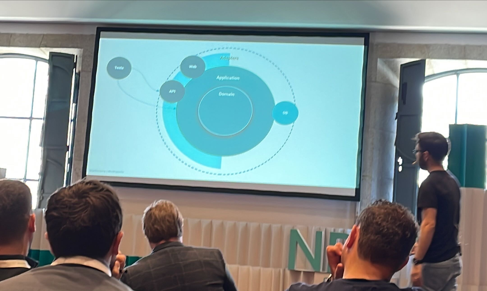
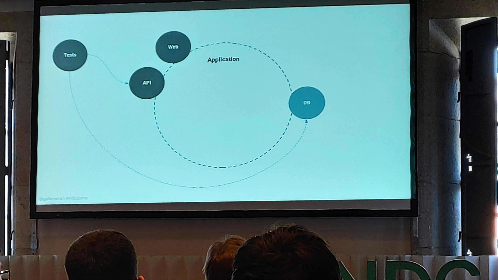
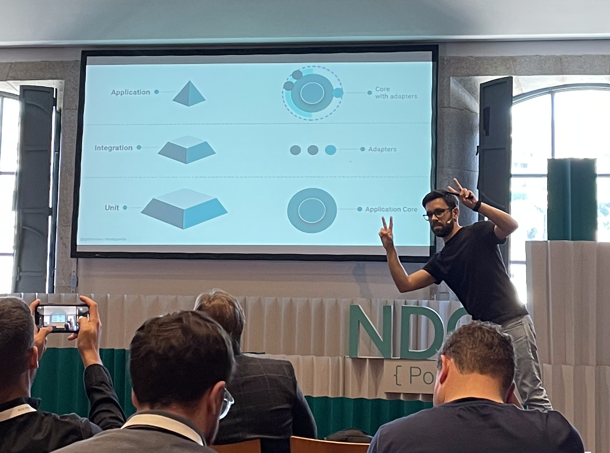
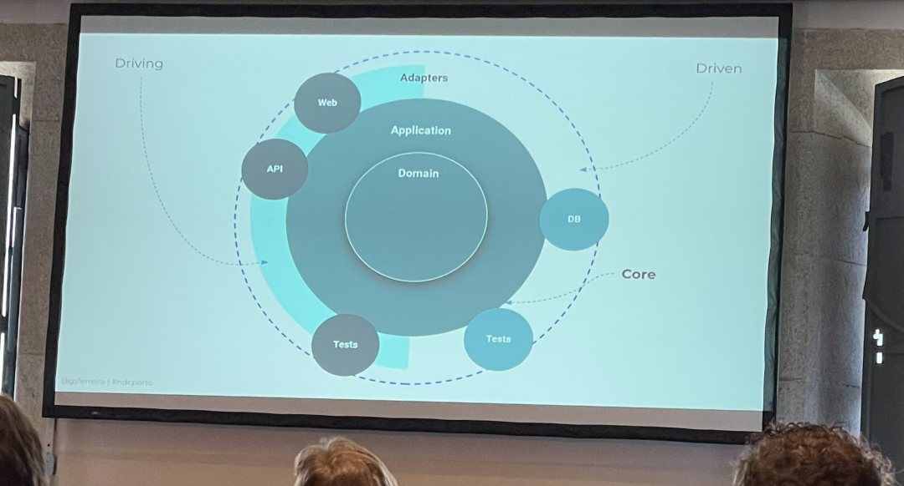

# The Grand Unified Theory of Clean Architecture and Test Pyramid by [Guilherme Ferreira](https://twitter.com/gsferreira)
Clean Architecture and Test Pyramid are two important theories of the software world, but how to combine them?

## Simplify your life
- Delay Decisions
    - Know what test to write
    - Write less tests

## Hexagonal Architecture


- Driving Adapters vs Driven Adapters
    - `Driving` : Primary actors driving the interaction
        - Front applications
        - Mobile Apps
        - Message queues
        - ...
    - `Driven` : Secondary actors driven by the interaction
        - Repository
        - Remote Application
        - ...
    - Every port should have at least 2 Adapters : 
        - 1 implementation
        - 1 testing adapter 



- `Screaming Architecture`
    - Clear what is done by your system.
    - Components are not grouped by `what they are` but `what they do`.

## Tests Pyramid


## Unit Test ?
Michael Feathers came up with a set of guidelines for designing unit tests way, way back in the proverbial Mists of Time that goes like this:
```text
A test is not a unit test if:
✅ It talks to the database
✅ It communicates across the network
✅ It touches the file system
✅ It can’t run at the same time as any of your other unit tests
✅ You have to do special things to your enviroment (such as editing config files) to run it”
```
-  Test Desiderata
    - Principles to follow for our tests




## How to test


- Integration Tests	
    - Mock your Core Domain
    - Easier than mocking the DB or mounting containers
- Application Tests
    - E2E, functional, Acceptance



## Conclusion


- `Focus on simplicity`
- `Reduce your tests as much as possible` - avoid sunk cost fallacy
- Optimize and deduplicate
    - Red tests on application tests
    - Red down ?
        - Make a red one lower and deduplicate

`Test description and when to write them should  be easy`

## Resources
- TDD and Clean Architecture by Valentina Cupac : https://optivem.com/wp-content/uploads/2022/05/Optivem-TDD-and-Clean-Architecture-Use-Case-Driven-Development.pptx.pdf
- Test Desiderata : https://kentbeck.github.io/TestDesiderata/
- Solitary vs sociable tests : https://martinfowler.com/bliki/UnitTest.html
- Hyrum’s law :https://www.hyrumslaw.com/