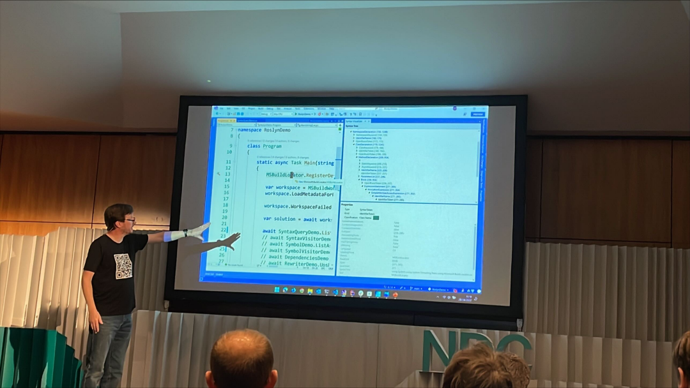
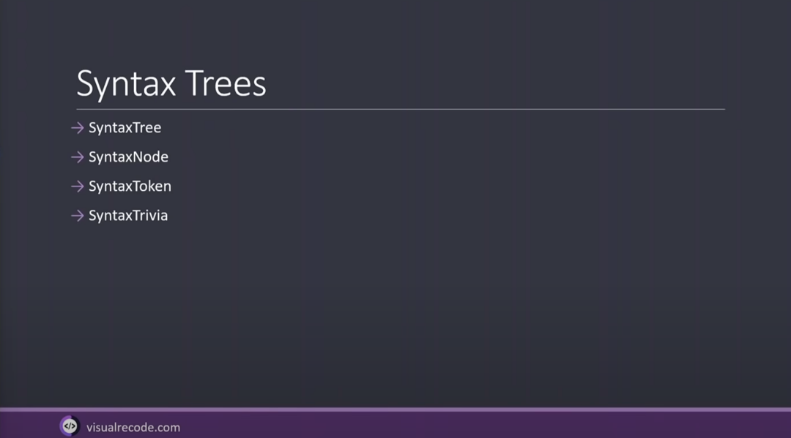
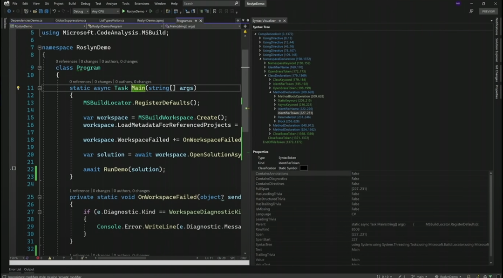
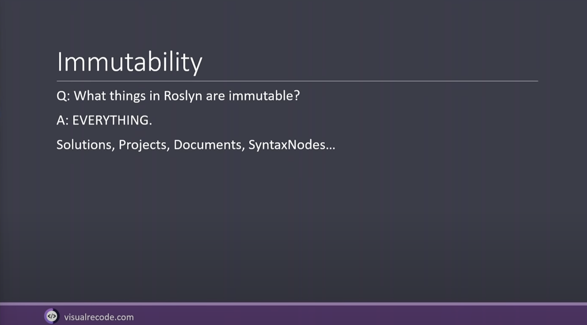
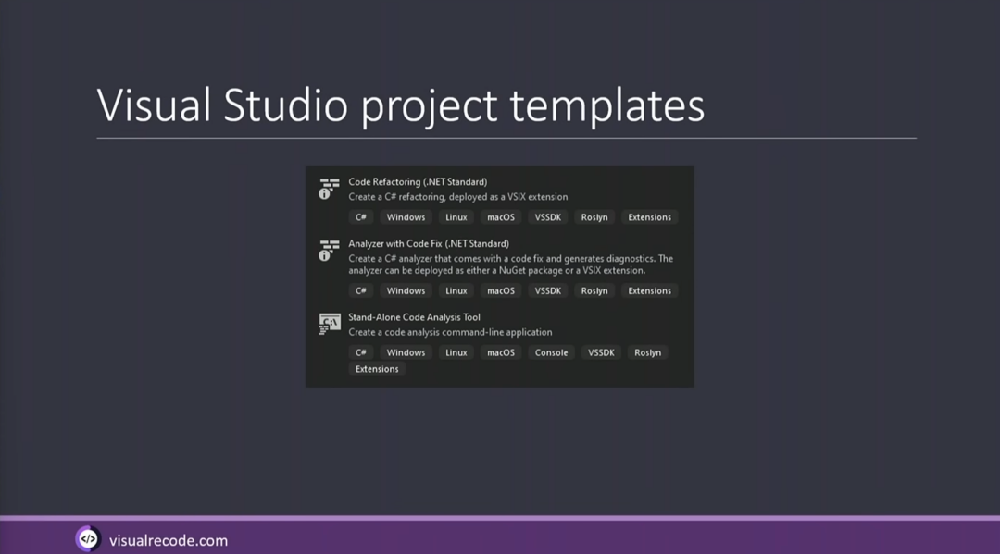
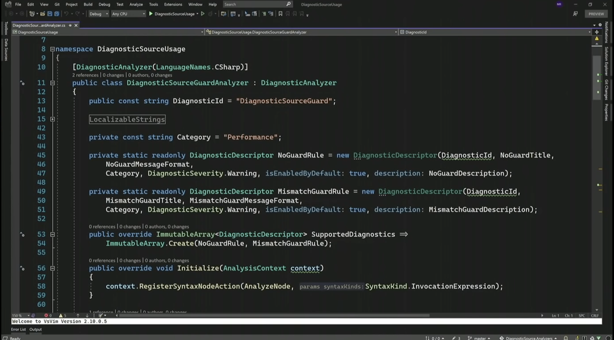
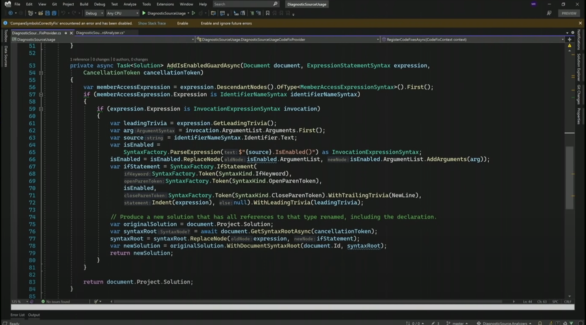

# Automate yourself out of a job with Roslyn by [Mark Rendle](https://twitter.com/markrendle)

Roslyn is Microsoft's `compiler as a platform` for C# and VB.NET. You can use it to read, analyze or modify existing code, or make squigglies in Visual Studio, or even generate and compile entirely new code at runtime because you're insane.

## How to
- Write code that writes code with Roslyn



- How to Roslyn
   - Nuget packages to explore
   - Ms.CodeAnalysis.Workspaces (contains your code)
- Workspaces
   - Top level container
- Visual Recode
   - WCF to grpc
   - https://visualrecode.com/



- `Syntaxtrivia` : everything not compiled into IL (comments, virgules, …)
- `SyntaxVisualizer` : SyntaxTree of your code
- We can interact with the Syntax Tree through `Visual Studio`



- VisitClassDeclaration
    - Call base method otherwise it stops...
    - Not really a `Visitor` 😜

```csharp
public class ListTypesWalker : CSharpSyntaxWalker
{
    public override void VisitClassDeclaration(ClassDeclarationSyntax node)
    {
        Write(node);
        base.VisitClassDeclaration(node);
    }

    public override void VisitInterfaceDeclaration(InterfaceDeclarationSyntax node)
    {
        Write(node);
        base.VisitInterfaceDeclaration(node);
    }
    
    private static void Write(BaseTypeDeclarationSyntax node)
    {
        var namespaceDeclarationSyntax = node.FirstAncestorOrSelf<NamespaceDeclarationSyntax>();
        var typeName = node.Identifier.Text;
        var namespaceName = namespaceDeclarationSyntax?.Name.ToString();
        Console.WriteLine($"{namespaceName}.{typeName}");
    }
}
```

- `CSharpSyntaxRewriter` to change / write syntaxTrees
```csharp
public class StringLiteralUpshifter : CSharpSyntaxRewriter
{
    private readonly SemanticModel _model;

    public StringLiteralUpshifter(SemanticModel model)
    {
        _model = model;
    }

    public override SyntaxNode? VisitLiteralExpression(LiteralExpressionSyntax node)
    {
        if (_model.GetTypeInfo(node).Type is INamedTypeSymbol type)
        {
            if (type.Name == "String" && type.GetMembers(nameof(string.ToUpperInvariant)).FirstOrDefault() is IMethodSymbol)
            {
                return SyntaxFactory.InvocationExpression(
                    SyntaxFactory.MemberAccessExpression(
                        SyntaxKind.SimpleMemberAccessExpression,
                        node,
                        SyntaxFactory.IdentifierName(nameof(string.ToUpperInvariant)))
                );
            }
        }
        return base.VisitLiteralExpression(node);
    }
}
```

- Really `tricky` to change the Syntax Tree...



```csharp
static class RewriterDemo
{
    public static async Task UpshiftAllStrings(Workspace workspace)
    {
        var newSolution = workspace.CurrentSolution;

        int count = 0;

        foreach (var project in workspace.CurrentSolution.Projects)
        {
            var compilation = await project.GetCompilationAsync();
            if (compilation is null) continue;

            foreach (var document in project.Documents)
            {
                var root = await document.GetSyntaxRootAsync();
                if (root is null) continue;
                
                var model = compilation.GetSemanticModel(root.SyntaxTree, true);
                if (model is null) continue;

                var isAutoGenerated = root.GetLeadingTrivia()
                    .Any(ContainsAutoGeneratedComment);

                if (isAutoGenerated) continue;
                
                var upshifter = new StringLiteralUpshifter(model);

                // Handle nodes and parent by your own
                // Create your own set of extension methods
                var newRoot = upshifter.Visit(root);

                if (!newRoot.IsEquivalentTo(root))
                {
                    ++count;
                    newSolution = newSolution.WithDocumentSyntaxRoot(document.Id, newRoot);
                }
            }
        }

        if (!ReferenceEquals(newSolution, workspace.CurrentSolution))
        {
            workspace.TryApplyChanges(newSolution);
            Console.Write($"{count} changes applied.");
        }
    }

    private static bool ContainsAutoGeneratedComment(SyntaxTrivia trivia)
    {
        var kind = trivia.Kind();

        if (kind != SyntaxKind.SingleLineCommentTrivia && kind != SyntaxKind.MultiLineCommentTrivia) return false;
        
        var comment = trivia.ToString();
        return comment.Contains("autogenerated") || comment.Contains("auto-generated");
    }
}
```

- You can package your own RoslynAnalyzers
   - `DiagnosticAnalyzer` : Makes the Squiggles
   - `CodeFixProvider` : Fixes the Squiggles






- Embed `Analyzers` in your shared library
    - To ensure people use it well
    - Help your users through `Roslyn`

## Resources
- Talk video : https://youtu.be/_cIVa-RctcA
- Source code : https://github.com/RendleLabs/DotNetNottsRoslynDemo
- .NET Analyzers : https://github.com/DotNetAnalyzers
- Learn Roslyn : https://joshvarty.com/learn-roslyn-now/
