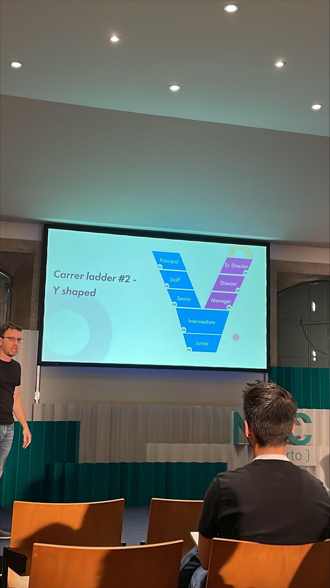
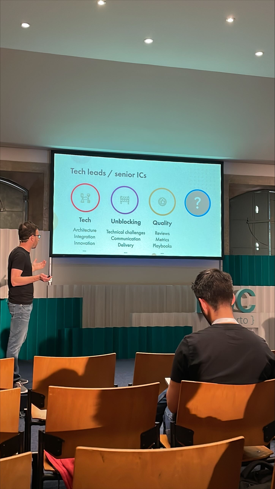
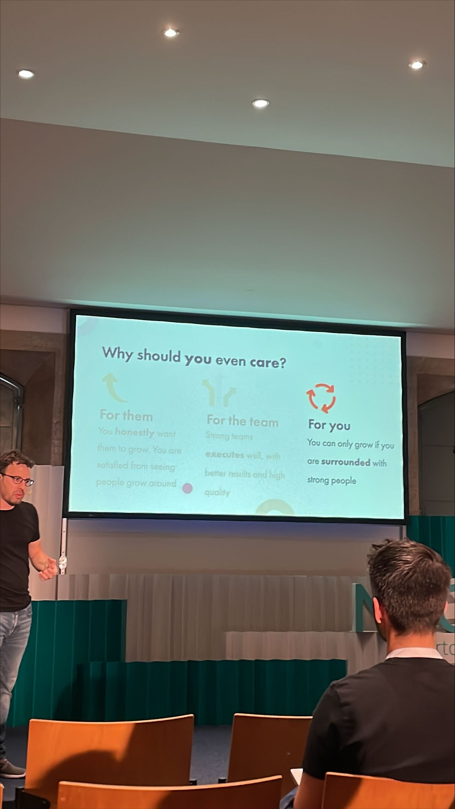
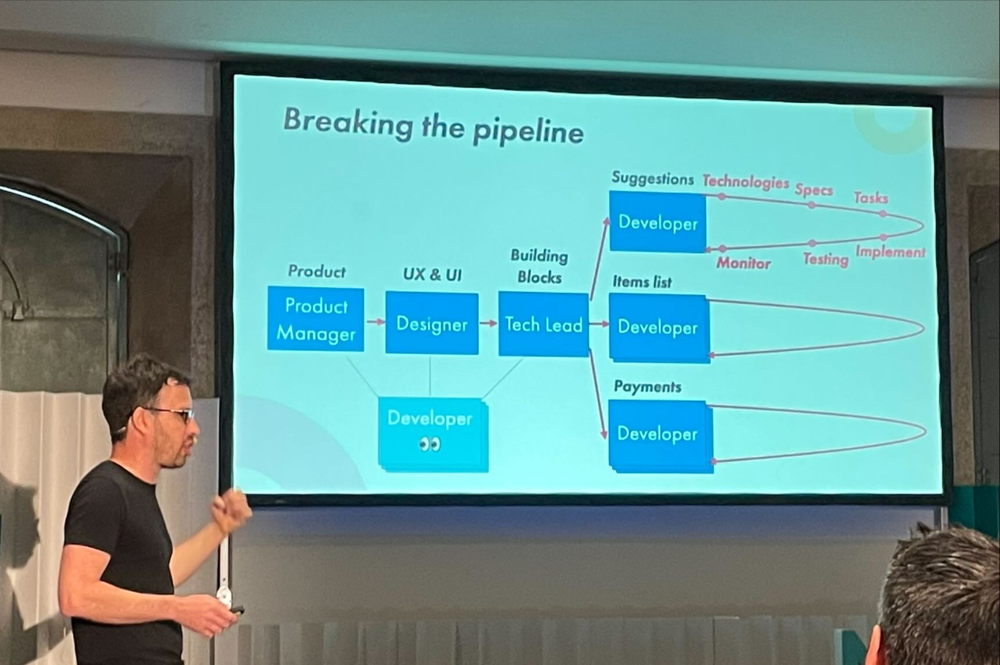
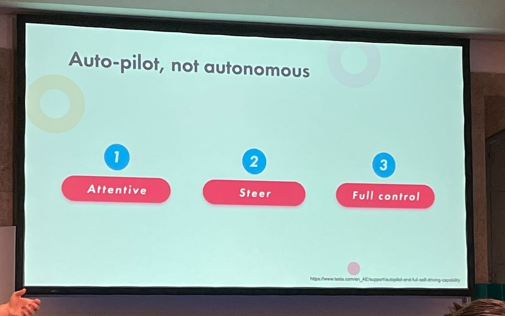
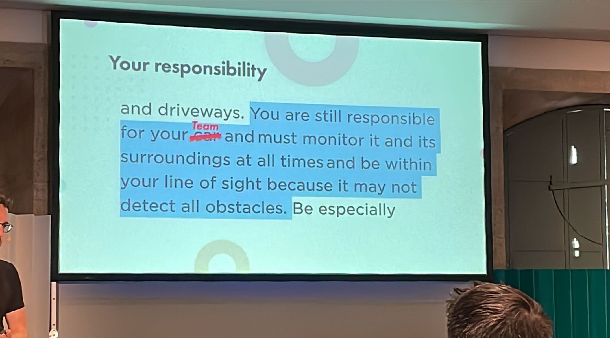
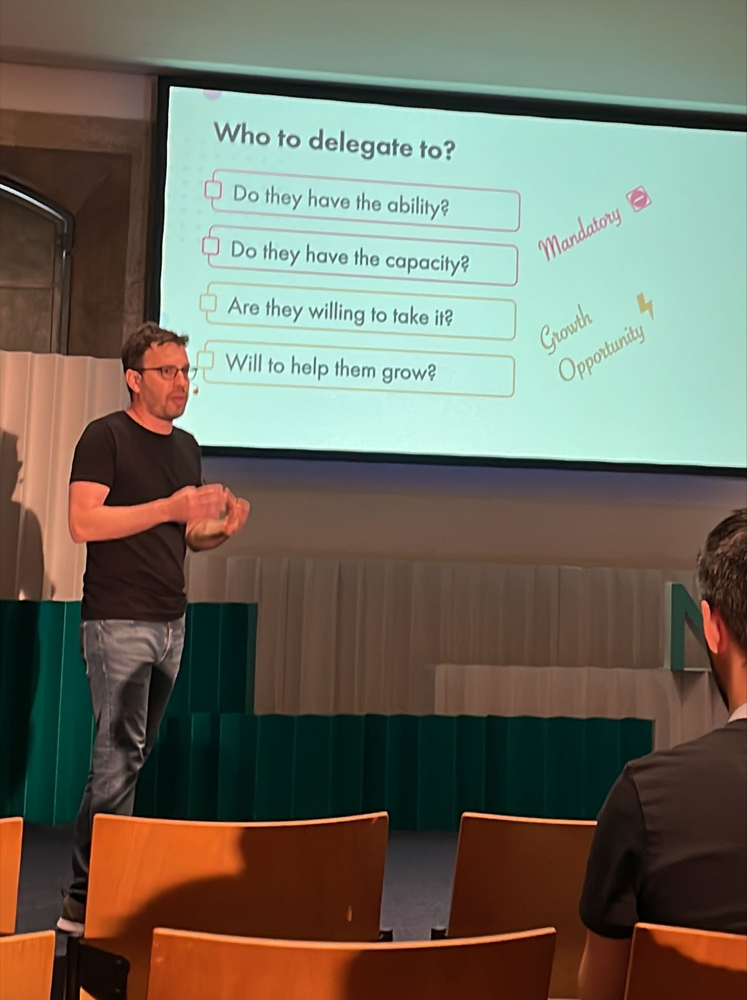
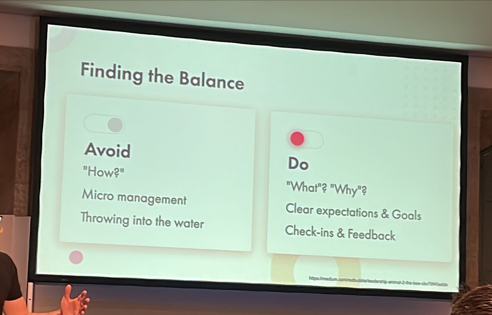

# Supporting your peers' growth as a tech lead by [Alon Kiriati](https://twitter.com/akiriati)
As an experienced individual contributor you might believe that all you should care about is your own growth — after all you are an “individual” contributor.

In this talk I’ll explain why `caring for your team` shouldn’t be unique to just your manager, and how it could `make you a better professional`.
We will cover the challenges and advantages that you could face, and also share practical tips to help your peers thrive in their work.

## Career ladder
- Stop vertical career ladder
    - Good dev vs good manager
    - Single career path
    - You lose the best dev and you get a bad manager
- Alternative : `Y shaped`

- Career frameworks : https://www.levels.fyi/
- Managers main focus : 
    - Hire
    - Culture
    - Strategy
    - Growth

## Tech leads main focus

- `Help others grow`
- You can only grow if you are surrounded by `strong` people
- Why should you even care ?
    - For them
    - For the team
    - For you

- Challenges
    - Time consuming
	- Lack of skillset

## Break the pipeline
- Developers involved from the beginning

## How to ?
- Give autonomy
    - Delegate : do less, review more

- Quotes from Tesla conditions
- Good things take time :
    - Short term : 
        - more time
        - potentially lower quality
        - double work
    - Long term : 
        - reducing bottleneck
        - higher satisfaction
        - can be more strategic 
    
## Ensure safety net
- Should you delegate ? (decision tree)
    - Not sensitive ?
    - Not urgent ?

## Take it to the next level
- Mentor more senior engineers
    - New challenges
    - More complex issues
- Cross team impact :
    - `Onboarding team`
        - Review the onboarding process
        - Create an on-boarding to facilitate hiring integration
        - Improve newjoiner satisfaction
    - Technical Community of Practice
        - If none it is a good opportunity
        - Create one
    - Internal conferences / talks

## Resources
- Talking with Tech Leads Talk - Patrick Kua : https://www.youtube.com/watch?v=5lmJdg5HQco&ab_channel=BuildStuff